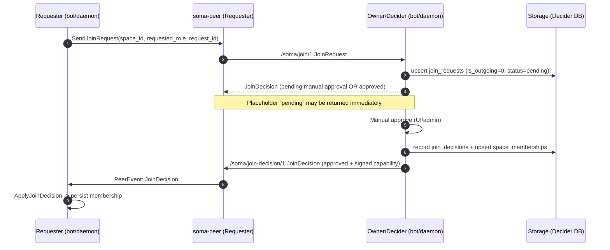
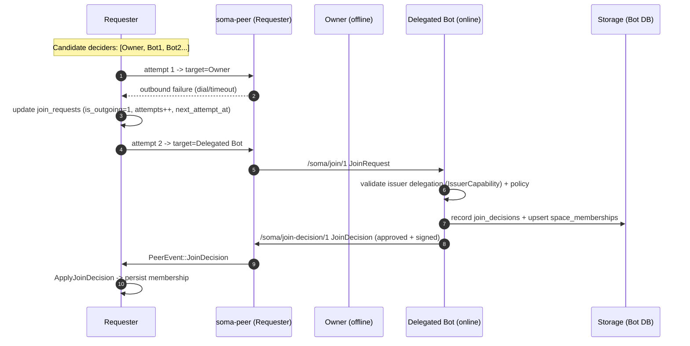
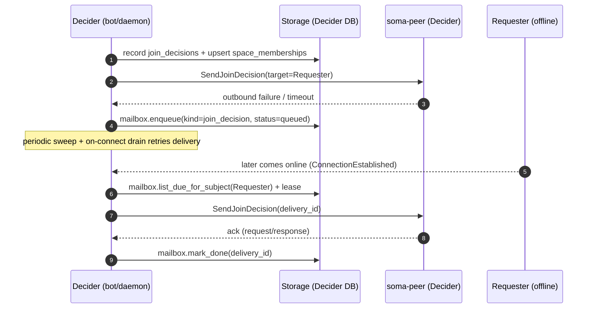

# SOMA

This document describes the repository layout, code structure, and coding conventions for working on Soma and Tapia in this monorepo.

## Terminology: VDF

In this repo, **VDF** refers to a **cache-only peer role** (sometimes casually written as “VDFS” in chat) that exists to improve availability/latency by **fetching and caching data addressed by content IDs**.

- VDFs **never accept user uploads** and are **not a source of truth** for user-created blobs.
- VDFs may persist cache in-memory (LRU/TTL), on disk, or via an external cache (e.g. Redis), but **cache writes are allowed only as a side-effect of fetching/verifying content**.
- VDFs must **verify bytes match the claimed CID** before serving/persisting.
- Naming note: the Rust crate is currently `soma-vdfs` for historical reasons, but “VDF” is the intended role/term in docs and conversations.

## Repository Layout

- `backend/` – Rust workspace for **all** backends (desktop + server) and supporting crates.
    - Desktop peer/agent binaries: `soma-daemon` (Unix socket; no Axum), `soma-agentd` (desktop-only companion).
    - Server peer/infra binaries: `soma-botd`, `soma-relayd`, `soma-rendezvousd`, `soma-bffd`, `soma-serverd`.
    - Crates: core domain, networking, storage, API, relay, rendezvous, BFF, and shared utilities.
- `desktop/` – Electron/React applications and packaging.
    - `desktop/soma/` – main Soma desktop UI.
    - `desktop/soma-app/` – Soma Tauri v2 app (migration target; Rust main process).
    - `desktop/tapia/` – Tapia typing companion app.
- `docs/` – MkDocs documentation (`docs/src/` for markdown, `docs/mkdocs.yml` for navigation).
- `proto/` – shared protocol definitions and codegen inputs.
- `deploy/` – Helm charts and infrastructure manifests.
- `prd/` – product requirements and high-level product documentation.
- `.github/packaging/` – release/packaging templates and helpers for CI.

When in doubt, place:

- shared Rust logic under an appropriate `backend/crates/*`.
- UI logic under `desktop/soma` or `desktop/tapia`.
- long-lived infra logic under `backend/crates/*`.
- user-facing docs under `docs/src/`.

Docs quickstart:

- Local build: `cd docs && mkdocs build` (CI installs MkDocs; locally you may want a venv/pipx if `pip` is externally-managed).
- Repo helper: `just build-docs` (writes to `./site`).

## Tech Stack

- **Package manager**: `pnpm` (workspace at `desktop/pnpm-workspace.yaml`).
- **Desktop apps**: Electron + React + TypeScript (`desktop/soma`, `desktop/tapia`), plus Tauri v2 + Rust main process (`desktop/soma-app`).
- **Backends**: Rust.

## CI, Packaging, and Releases

This repo uses GitHub Actions workflows that are designed to be triggered manually (`workflow_dispatch`).

- **Daemon + agent releases**: `.github/workflows/release-daemons.yml`
  - Builds `soma-daemon` and `soma-agentd` for `linux/macos` × `amd64/arm64` using `cross` (via `.github/actions/cargo-cross-build/action.yml`).
  - Publishes assets to GitHub Releases (never “latest”) with OS/arch suffixes.
- **Desktop releases (Soma)**: `.github/workflows/release-desktop.yml`
  - Builds desktop artifacts for `linux/macos` × `amd64/arm64` and publishes to GitHub Releases (never “latest”).
- **Docker images**: `.github/workflows/docker-backend.yml`
  - Builds/pushes multi-target images from `Dockerfile` (manual-only), gated by a successful `soma-daemon` cross-build matrix.
- **Bundle releases**: `.github/workflows/release.yml`
  - Bundles published daemon/agent and desktop versions into OS-specific installers (`.deb/.rpm/.pkg/.zip`) and uploads them to a GitHub Release.

SBOM:
- SBOMs are generated in CI using `anchore/sbom-action` (Syft). There is no `sbom/` scripts folder anymore.

Packaging templates:
- Templates live under `.github/packaging/templates/` and are rendered by `.github/scripts/release_bundle.py`.
- See `.github/packaging/templates/README.md` for the template variables and file list.

## Dependency Policy

### Rust (Cargo workspace)

- Third-party dependency versions are declared **only** in `backend/Cargo.toml` under `[workspace.dependencies]`.
- All crates and binaries under `backend/crates/*` and `backend/bins/*` must depend on third-party crates using `{ workspace = true }`.
- If a crate needs optional capabilities, add `features = [...]` on the `{ workspace = true }` dependency in that leaf `Cargo.toml`.
- Do not add `version = "..."` for third-party crates anywhere except `backend/Cargo.toml`.

### Backends

All backends:

- use `clap` for CLI parameters and environment variable configuration.
- use `mimalloc` for allocation.

Peer/daemon backends:

- accept a **blob storage pool** path (a plain folder) via configuration for storing large binary assets.
- use `yjs-rust` to reconcile collaborative content/state.
- use SQLite on desktop; server deployments can enable PostgreSQL via Cargo features.

### Blobs (content-addressed, daemon-owned)

Soma treats binary assets (“blobs”: files, images, attachments, Yoopta-related assets, …) as **content-addressed objects** stored outside Yjs/Yoopta. Collaborative documents should only contain **references** to blobs.

#### Roles and rules

- `soma-daemon` is the **source of truth** for user-created blobs (writes allowed).
- `soma-botd` (both `bot` and `server-daemon` modes) is **cache-only** for blobs (writes allowed only as a side-effect of *fetching* a blob from the network; never accepts user upload).
- Blob identity is a CID computed from bytes (e.g. `sha256`), and storage is keyed by CID (content-addressed).

#### Upload and persistence (daemon only)

- The only supported “upload” entrypoint is local IPC to `soma-daemon` (Unix socket gRPC / daemon API).
- `soma-daemon` persists bytes into its configured blob storage pool (space-scoped layout recommended) and records minimal metadata (size, content type, original name).
- `soma-daemon` emits a peer event **only** when the blob is associated with Yoopta content (i.e. the upload includes Yoopta context like a document ID / node ID). Non-Yoopta blobs are stored but do not generate Yoopta-related peer events.

Where to wire this:
- Peer event definitions: `backend/crates/peer/src/lib.rs`, `backend/crates/peer/src/events.rs`
- Daemon storage + IPC/controller: `backend/bins/daemon/`

#### Network distribution (fetch + cache)

- Peers retrieve blobs from each other by CID over libp2p (a simple request/response “get by CID” protocol).
- When a Yoopta document starts referencing a blob, the writer can publish a lightweight “blob availability hint” (metadata only) so other peers know what to fetch/cache.
- `soma-botd` participates as a peer that can:
  - serve blobs it already has in cache
  - fetch blobs on-demand and keep them if they’re frequently used
  - evict according to policy (LRU/TTL + size cap)

Non-goals / guardrails:
- No HTTP upload endpoints in `soma-botd` in any mode.
- No network “push bytes to bot” protocol; blob transfer is pull-based by CID.
- Do **not** embed multiaddrs in Yoopta content (they are ephemeral) and do **not** assume every user has a bot; references must resolve via any reachable peer.

#### Yoopta integration

- Yoopta content must store blob *references* (structured objects) rather than bytes.
- A reference should include at least: `cid`, `mime`, `size`, and optional `name` (and any renderer-specific fields).
- Dialing happens at runtime: peers fetch by CID using `/soma/blob/1` from any reachable peer that has the blob (daemon store or bot cache).

#### Space mirror bots (cache “everything referenced”)

Some deployments want an always-on bot to cache the complete set of blobs referenced by a space (to improve availability/latency for other peers).

- Role: a `soma-botd` instance can run as a **space mirror**:
  - maintains a local `blob-cache-dir` (cache-only, populated via fetch)
  - attempts to keep all referenced CIDs for configured spaces present locally
- How the bot learns “what to cache”:
  - **Announce-driven**: when a daemon stores a blob and writes a Yoopta reference, it publishes a lightweight “blob announce” (space_id + cid + mime + size). Mirror bots enqueue a fetch for announced CIDs.
  - **Crawl/reconcile**: periodically scan the space’s collaborative state/docs, extract blob references, and reconcile (fetch missing; optionally evict unreferenced with TTL).
- Fetch strategy:
  - try any reachable peers (peerstore/Identify, rendezvous discovery, relays) until one serves the CID
  - keep a retry queue (DB-backed, mailbox-style) for transient failures and offline sources
- Cache policy:
  - “mirror mode” prefers retention for referenced blobs; eviction is bounded by size/TTL and “unreferenced for N days”
  - bots still never accept user uploads; the cache is filled only by pulling verified bytes (CID match)

#### Security and limits

- Always validate declared sizes/content types and enforce maximum blob sizes at ingress (daemon IPC) and at egress (network transfer).
- Always verify bytes match the CID before persisting/serving.
- Treat all remote blobs as untrusted: no automatic execution/rendering without appropriate sandboxing in the UI.

Specific services (all now live under `backend/`):

- **Relay** (`backend/bins/relayd`, `backend/crates/relay`): libp2p circuit-relay node, plus an Axum HTTP server and a small metrics server.
- **Rendezvous** (`backend/bins/rendezvousd`, `backend/crates/rendezvous`): libp2p rendezvous discovery service, plus an Axum HTTP server and a small metrics server.
- **Desktop peer/daemon** (`backend/bins/daemon`, `soma-daemon`): the desktop user agent (Unix socket IPC). Desktop backends must not depend on Axum.
- **Server peer/bot** (`backend/bins/botd`, `soma-botd`): a server-hosted libp2p peer/bot with an Axum control plane + metrics.
- **LLM BFF** (`backend/bins/bffd`, `backend/crates/bff`): a backend-for-frontend for interacting with LLMs via `llama-cpp-2`; runs `mimalloc` + Axum + a small metrics server. This is the only backend that does **not** use libp2p.
  - Note: `soma-bffd` can optionally enable a small libp2p peer for diagnostics/testing, but the core service does not depend on libp2p.

#### `soma-botd` internals (event handling + metrics)

`soma-botd` processes libp2p events through a small dispatcher with per-handler queues:

- Entry point: `backend/bins/botd/src/main.rs`
- Runtime loop + wiring (peer spawn, HTTP spawn, dispatcher): `backend/bins/botd/src/runtime.rs`
- Peer event handlers:
    - Metrics: `backend/bins/botd/src/event_handlers.rs` (`MetricsHandler`, handles **all** `PeerEventKind`s)
    - Logging: `backend/bins/botd/src/event_handlers.rs` (`LoggingHandler`, selected events only)
- Prometheus metrics definitions/registration: `backend/bins/botd/src/metrics.rs`
- Storage: SQLx AnyPool (Postgres or SQLite) via `soma_core::db::DbFactory`. Config via `--database-url` / `SOMA_DATABASE_URL` (defaults to `./botd.db` SQLite). Migrations are shared under `backend/crates/storage/migrations` and embedded at startup (`sqlx::migrate!("../../crates/storage/migrations")` in `runtime.rs`); startup fails if migration fails.
- Join decider: auto-approves only when the bot holds a valid issuer capability for the space (role/expiry enforced) and signs the membership capability with its libp2p identity key; otherwise the join is recorded for manual approval in storage.

#### Operating modes (bot vs server-daemon)

`soma-botd` is a peer first. Its HTTP surface depends on an operating mode:

- `bot` mode (default): read-only HTTP endpoints only (`/info`, `/healthz`, `/metrics`). No business APIs (`/v1/*`) at all.
- `server-daemon` mode: exposes a daemon-like control plane over HTTP for admin operations (join decisions, revocation, roster, issuer delegation, mailbox, …). This mode must be authenticated/authorized. Join control surfaces: `POST /v1/join/request` (send join request over libp2p), `GET /v1/join/requests` (list pending), `POST /v1/join/decide` (approve/reject; signs capability on approve).

Rule of thumb: keep business logic in `soma-peer` and treat Axum/gRPC surfaces as controllers that call into peer services/deciders.

Mode responsibilities (high-level):

- `bot` mode:
    - Runs a peer (`soma-peer`) + event handlers (metrics/logging).
    - Exposes read-only HTTP only.
    - Can be configured with an automated join decider, but has no public write surface.
- `server-daemon` mode:
    - Runs the same peer + storage, but additionally exposes admin/business HTTP APIs.
    - Business endpoints must be gated by mode and protected with authn/authz.
    - Controllers must delegate to `soma-peer` + repositories (no direct business logic in Axum handlers).

When adding new peer events or instrumentation, prefer:

- Updating `soma-peer` event definitions (`backend/crates/peer/src/lib.rs`, `backend/crates/peer/src/events.rs`)
- Adding a matching metrics/logging branch in `backend/bins/botd/src/event_handlers.rs`

- `soma-daemon`:
    - Entry point: `backend/bins/daemon/src/main.rs`
    - Runtime loop + wiring: same pattern as botd but gRPC over Unix socket (`backend/bins/daemon/src/grpc.rs`)
    - Event dispatcher: `backend/bins/daemon/src/dispatch.rs`
- Storage: SQLx AnyPool over SQLite via `soma_core::db::DbFactory` (config `--db-path` / `SOMA_DAEMON_DB`, defaults to `./daemon.db`). Migrations are shared under `backend/crates/storage/migrations` and embedded at startup (`sqlx::migrate!("../../crates/storage/migrations")` in `main.rs`); startup fails if migration fails.

### Business Logic & API Checklist for Backends

Use this list to track domain flows and where the API lives. Mark items off as you implement them end-to-end (daemon ↔ bot ↔ peer).

- [x] Space join request & decision
    - Daemon gRPC: `Daemon/JoinSpace(space_id, display_name, device_name, target_peer_id, target_multiaddrs)` (Unix socket, proto `proto/daemon/v1/daemon.proto`)
    - Join protocol: handled in `soma-peer` via a pluggable join decider (default: reject-all). Controllers (daemon/bot) supply a decider and/or admin actions. Membership capabilities are signed with the peer’s libp2p identity key when approved.
    - Bot mode (`soma-botd --mode bot`): auto-approves only when it holds a valid issuer capability for the space; otherwise records a pending join and rejects until manually approved elsewhere. HTTP stays read-only.
    - Server-daemon mode (`soma-botd --mode server-daemon`): authenticated admin surface for join control (`POST /v1/join/request`, `GET /v1/join/requests`, `POST /v1/join/decide`); controllers delegate to storage + decider (no force-mint).
    - Daemon gRPC also exposes manual approval surfaces: `Daemon/ListJoinRequests`, `Daemon/DecideJoin` and membership queries via `Daemon/ListMyMemberships`.
- [ ] Space create & ownership genesis (verifyable)
    - Add a real “space genesis” artifact (owner-signed record) that other peers can verify; current `spaces.owner_peer_id` is DB-local metadata only.
- [ ] Issuer capability lifecycle (secure)
    - Verify `IssuerCapability.signed` (owner signature) and enforce expiry/allowed roles consistently before auto-approving.
    - Expose issuer delegation issuance/rotation from both daemon gRPC and server-daemon HTTP (and keep it auditable).
- [ ] Signature verification on join receipt
    - Verify `MembershipCapability.signed` on the receiver (daemon) using the issuer public key from libp2p Identify.
    - If issuer != owner, verify issuer delegation chain (owner → issuer capability → membership).
- [ ] Canonical signing format
    - Current signing uses CBOR encoding via `ciborium`, but canonical CBOR is not guaranteed; move to a canonical CBOR scheme before relying on signatures across versions/implementations.
- [x] Async manual join decision delivery (in-band)
    - Manual approvals complete via an in-network push: `/soma/join-decision/1` (libp2p request/response) sends a `JoinDecision` to the requester; requester persists membership/decision on receipt.
    - If the requester is offline, the approver enqueues the outgoing decision in `mailbox` and retries later (TTL bounded; retries with backoff).
- [ ] Multi-target join submission (recommended)
    - Requesters should try multiple candidate deciders (owner first, then delegated bots) until one responds; this avoids a hard dependency on any single online peer.
- [ ] Space membership revocation/leave
    - Server-daemon HTTP (mode-gated): `POST /v1/space/revoke` (botd) to revoke capabilities by `space_id` and `subject_peer_id`; daemon gRPC: `Daemon/RevokeSpace` to request or consume a revocation and drop local capability
- [ ] Space roster/query
    - Server-daemon HTTP (mode-gated): `GET /v1/space/members` (botd) to list current members with roles/expiry; daemon gRPC: `Daemon/ListSpaceMembers` to fetch + cache
- [ ] Issuer delegation management (bots acting on behalf of owners)
    - Server-daemon HTTP (mode-gated): `POST /v1/space/issuer-capability` (botd) to rotate/issue issuer delegation for a bot; daemon gRPC: `Daemon/IssueIssuerCapability` to accept and persist
- [ ] Space discovery/onboarding UX helpers
    - Daemon gRPC: `Daemon/DiscoverSpaces` to surface available spaces via rendezvous/relay metadata for UIs

### Storage schema (SQLx-backed)

Botd (Postgres or SQLite via `SOMA_DATABASE_URL`) and daemon (SQLite file) embed the same migrations (`backend/crates/storage/migrations`). ER diagram (entities → PKs):

- `spaces(space_id)` – optional display_name, created_at
- `space_memberships(space_id, subject_peer_id)` – role, issuer_peer_id, issued_at, expires_at, capability blob
- `join_decisions(decision_id)` – space_id, subject_peer_id, decision enum, reason, created_at, capability blob (audit)
- `join_requests(request_id)` – join request tracking for both incoming manual approvals and outgoing submissions:
  - Incoming (approver-side): `is_outgoing=0`, `target_peer_id=<this_peer>`, `status=pending` (used by `ListJoinRequests`/`/v1/join/requests`).
  - Outgoing (requester-side): `is_outgoing=1`, `target_peer_id=<chosen_decider>`, `status/attempts/next_attempt_at/last_error` for local UI status.
- `issuer_capabilities(space_id, delegate_peer_id)` – issuer_peer_id, issued_at, expires_at, capability blob
- `mailbox(id)` – kind, space_id?, subject_peer_id?, status (queued|leased|done|dead), attempts, available_at, lease_until?, leased_by?, payload blob, created_at

Migrations are centralized in `backend/crates/storage/migrations` and embedded by both `soma-daemon` and `soma-botd` at startup.

### Persistence

- Use `soma_core::db::DbFactory` to build pools and run migrators.
- Keep SQLx queries out of controllers; add repository modules per aggregate under `backend/crates/storage` (memberships, issuers, mailbox).

### Design patterns in use (and how to apply them here)

- **Facade**: `soma_core::db::DbFactory` wraps SQLx driver registration, URL normalization, and migrations behind a single builder. Reuse this facade instead of constructing pools manually.
- **Factory Method / Builder**: `DbFactory::any/sqlite` return configured builders; use `.max_connections` and `.build_*` to tailor pools per binary.
- **Delegation**: Event dispatchers route `PeerEvent` to handlers; add new handlers by implementing `PeerEventHandler` and registering in `build_dispatcher`.
- **Chain of Responsibility**: The dispatcher plus multiple handlers form a chain; each handler can choose to act or ignore. To extend behavior, add another handler instead of bloating existing ones.
- **Strategy**: Logging vs metrics handlers represent interchangeable strategies for reacting to events. Follow this pattern when adding new behaviors (e.g., persistence strategy for events).
- **Composite**: Per-kind handler lists in `PeerEventDispatcher` compose multiple behaviors as a single dispatcher. Group related handlers when you need combined behaviors.
- **Facade (control planes)**: HTTP/gRPC surfaces are controllers only; business logic lives in `soma-peer` + repositories. In `bot` mode, botd HTTP stays read-only; in `server-daemon` mode, write endpoints must be authenticated.
- **Singletons (where needed)**: Global allocator (`GLOBAL`), static migrators (`static MIGRATOR` per binary). Avoid new global state unless initialization must happen once.
- **MVC**: Treat Axum handlers as controllers (`http.rs`), DB + peer/service layers as model (state + persistence), and response serializers/views as the view. Keep controllers thin and push business logic into model/service helpers.
- **Repository**: Formalize DB access by wrapping SQLx queries per aggregate (memberships, join_decisions, issuer_capabilities) in dedicated modules to keep handlers/controllers thin.

### Frontends (Desktop Apps)

Shared frontend stack (Soma, Soma-app, Tapia):

- `pnpm` workspace under `desktop/`
- `tailwindcss` v4 + `daisyui` v5
- `@headlessui/react` for accessible unstyled primitives
- `class-variance-authority` + `tailwind-merge` (see `desktop/soma/src/renderer/src/lib/cn.ts` for the shared `cn` helper)
- `floating-ui`
- `use-debounce`
- `composed-offset-position`
- Motion for React (`motion`, https://github.com/motiondivision/motion)
- Routing: `react-router` core (prefer memory/hash routers for Electron; not `react-router-dom`)
- i18n: `react-i18next` + `i18next` with `i18next-chained-backend`, `i18next-http-backend`, `i18next-resources-to-backend`, `i18next-browser-languagedetector`; shared instance at `desktop/soma/src/renderer/src/lib/i18n.ts`
- Command palette + hotkeys: `react-hotkeys-hook` and `react-cmdk`

Soma (`desktop/soma`):

- Uses a client to call the Soma peer/daemon over its Unix socket API.
- Uses Yoopta for rich text editing (`@yoopta/editor` + `@yoopta/*` tools/plugins).
- Renderer routes live under `desktop/soma/src/renderer/src/routes/`:
  - `routes/router.tsx` defines route objects using `react-router` + `createHashRouter`.
  - `routes/layouts/*` are shell routes that render an `<Outlet />` and shared UI.
  - `routes/screens/*` are leaf “pages” that render screen content.
- Uses DaisyUI with two themes.
- Uses TanStack Query for optimistic UI flows.
- Main process uses InversifyJS (`inversify` + `reflect-metadata`) for DI; container lives in `desktop/soma/src/main/container.ts`.

Soma-app (`desktop/soma-app`) (Tauri v2):

- Migration target for Soma UI; Rust main process lives under `desktop/soma-app/src-tauri`.
- Renderer → main process uses `@tauri-apps/api/core` `invoke(...)` (no Electron preload bridge; no `window.api`).
- Tauri command state must be registered via `.manage(...)` and accessed with `tauri::State<'_, T>`.
- Desktop assumes `soma-daemon` is already running; do not start daemons from the renderer.
- No local blob persistence/caching in the desktop app: uploads go to `soma-daemon`, and renderers should use `soma-blob://daemon/{space_id}/{cid}` URLs for blob references.
- Local LLM chat runs via `soma-agentd` (gRPC over Unix socket); for model selection and “base vs instruct” behavior, see `docs/src/development/agentd-models.md`.

Tapia (`desktop/tapia`):

- Uses a client to call the Soma peer/daemon over its Unix socket API (e.g., saving leaderboard state).
- Uses `simple-keyboard`.
- Needs “text segmentation + cursor ranges” and a “diff/comparison engine”; choose stable, mature packages from the JavaScript package registry (common candidates: `graphemer` / `grapheme-splitter`, and `diff-match-patch` / `diff`).
- Uses Motion for micro-interactions (cursor movement/layout animations, color transitions, correct/incorrect feedback).
- Uses XState for state machines.

## Binaries and Responsibilities

This repo intentionally has multiple binaries. Each has a distinct goal and deployment context:

### Desktop vs Server (rule of thumb)

- **Desktop**: `soma-daemon`, `soma-agentd`, `soma` (UI), `tapia` (UI) — **no Axum**.
- **Server**: `soma-botd`, `soma-relayd`, `soma-rendezvousd`, `soma-bffd`, `soma-serverd` — **Axum + metrics**.

### Desktop / Peer Backends (`backend/`)

- `soma-daemon` (`backend/bins/daemon`, run with `cargo run -p soma-daemon`): the desktop **libp2p peer identity** process (Unix socket IPC). It must not include Axum.
- `soma-botd` (`backend/bins/botd`, run with `cargo run -p soma-botd`): the server-hosted **libp2p peer identity** process for bots/agents (Axum + metrics).
- `soma-agentd` (`backend/bins/agentd`, run with `cargo run -p soma-agentd`): optional **desktop-only** companion process for long-running CPU-heavy tasks (hashing, OCR, indexing, Yjs reconciliation, local LLM inference). It should be reached via local IPC (UDS) and typically through `soma-daemon`, not directly from the UI.
  - `llama-cpp-2` batch/logits gotcha: after `LlamaBatch::add_sequence(...)` with `logits_all=false`, llama.cpp only computes logits for the **last** token in the batch. Sampling from `idx=0` will crash (`invalid logits id 0, reason: batch.logits[0] != true`).
  - In `backend/bins/agentd/src/engine.rs`, ensure the first sampling step uses the last prompt-token index (`prompt_tokens.len() - 1`), then use `idx=0` once you decode a single token per step with `logits=true`.

### Infrastructure Backends (also `backend/`)

- `soma-relayd` (`backend/bins/relayd`, run with `cargo run -p soma-relayd`): **relay** service (libp2p circuit relay) + HTTP/Axum + metrics.
- `soma-rendezvousd` (`backend/bins/rendezvousd`, run with `cargo run -p soma-rendezvousd`): **rendezvous** service (libp2p discovery) + HTTP/Axum + metrics.
- `soma-bffd` (`backend/bins/bffd`, run with `cargo run -p soma-bffd`): **LLM BFF** service (no libp2p; `llama-cpp-2`) + HTTP/Axum + metrics.
- `soma-serverd` (`backend/bins/serverd`, run with `cargo run -p soma-serverd`): optional “all-in-one” runner that can compose multiple infrastructure services for convenience in dev.

## Code Style

### Rust

- Use stable Rust and keep code `rustfmt`-formatted.
- Prefer explicit, self-describing names; avoid single-letter identifiers except for well-understood indices.
- Keep modules small and cohesive: one primary concern per module.
- Use `tracing` for logging; avoid `println!` in production code.
- Surface errors with rich types (thiserror / anyhow patterns) rather than panicking; reserve `panic!` for truly unrecoverable situations.
- Keep async boundaries explicit and avoid blocking inside async tasks.
- Favor traits as the primary extension/abstraction mechanism:
  - Define behavior behind traits (with clear method contracts) rather than free-floating functions.
  - Prefer trait impls on small structs (or newtypes) over ad-hoc helper functions; use free functions only for pure, stateless utilities.
  - Add default methods on traits for common runners/wrappers instead of separate “helper” modules.
  - When extracting shared logic, start by defining the trait in the owning crate (e.g., peer/bootstrap, HTTP services, IPC services) and implement it per binary.

### TypeScript / React (Desktop Apps)

- Use modern TypeScript with `strict` type-checking.
- Follow the existing component organization in `desktop/*/src` (feature-oriented structure rather than huge generic folders).
- Use `kebab-case` for new `.ts`/`.tsx` filenames in both renderer and main process code.
- Use CUIDs for identifiers; do not use UUIDs.
- Prefer `@renderer/*` imports for renderer code (configured in `desktop/soma/tsconfig.web.json`) over deep relative paths.
- Prefer function components with hooks over class components.
- Use existing hooks and state containers before adding new global state mechanisms.
- Keep side effects (I/O, daemon calls) in dedicated hooks or services, not inside presentational components.
- Run the formatter/linter (`pnpm run format` / `pnpm run lint`) before committing.

### Documentation

- Write docs in Markdown under `docs/src/`.
- Reference concrete file paths and binaries when possible.
- Prefer short, scannable sections with headings and bullets rather than long walls of text.

## Testing and Validation

### Rust

- Run tests from the `backend/` workspace root:

  ```bash
  cd backend
  cargo test
  ```

- Run smoke tests that bind local sockets (relay/rendezvous metrics):

  ```bash
  cd backend
  cargo test -p soma-relay --test smoke -- --ignored
  cargo test -p soma-rendezvous --test smoke -- --ignored
  ```

- Add tests alongside the code they exercise (same crate, nearby module).
- Keep tests deterministic; avoid relying on external network or timing unless absolutely necessary.

### Desktop Apps

- Use `pnpm` for installs and scripts:

  ```bash
  cd desktop
  pnpm install
  pnpm --filter soma run typecheck
  pnpm --filter soma run lint
  ```

  and similarly for `desktop/tapia` (use `--filter tapia`).

- Keep unit tests small and focused; integration tests should run against local daemons where feasible.

### Manual Flows

- For end-to-end checks:
    - Run `soma-daemon` from `backend/`.
    - Start `desktop/soma` or `desktop/tapia` in dev mode.
    - Exercise join flows, class navigation, and basic messaging.

## Docker Images (Backend) and Docker Testing

This repo builds **backend Docker images** for server daemons using precompiled binaries. The goals are:

- small runtime images (distroless) that behave like production
- no Rust compilation during `docker build`
- multi-arch publish (amd64 + arm64) with consistent tagging

### Where it lives

- Workflow: `/.github/workflows/docker-backend.yml`
  - builds Linux MUSL binaries per arch
  - builds/pushes one image per daemon target
- Composite action: `/.github/actions/docker-build-backend/action.yml`
  - runs Trivy config scan on the repo/Dockerfile
  - builds with buildx (+ metadata tags/labels)
  - optionally pushes to GHCR (+ provenance + SBOM) and runs Trivy vuln scan
- Dockerfile targets: `Dockerfile` (`botd`, `relayd`, `rendezvousd`, `bffd`, `serverd`)

### Build inputs and expected layout

Docker builds copy **prebuilt** binaries from the build context:

- `dist/backend/linux-amd64/soma-*`
- `dist/backend/linux-arm64/soma-*`

The `Dockerfile` selects the correct directory using `ARG TARGETARCH` and:
- `COPY dist/backend/linux-${TARGETARCH}/soma-botd /app/soma-botd` (and similar for other targets)

Mermaid (CI build flow):
```mermaid
flowchart TD
  A[CI: docker-backend.yml] --> B[Build MUSL bins\nx86_64-unknown-linux-musl]
  A --> C[Build MUSL bins\naarch64-unknown-linux-musl]
  B --> D[Upload artifact\nbackend-bins-amd64]
  C --> E[Upload artifact\nbackend-bins-arm64]
  D --> F[Docker build job\n(per daemon target)]
  E --> F
  F --> G[Trivy config scan\n(scan-type=config)]
  G --> H[buildx build\n(Dockerfile target)]
  H --> I{push?}
  I -- no --> J[Build only]
  I -- yes --> K[Push to GHCR\n+ provenance/SBOM]
  K --> L[Trivy vuln scan\n(os+deps)]
```

### Image naming and tags (GHCR)

The workflow publishes images to GHCR using:
- `REGISTRY=ghcr.io`
- `IMAGE_NAME=${owner}/soma-backend` (lowercased in-job)

Each daemon is a separate image under that base name with a suffix:
- `-botd`, `-relayd`, `-rendezvousd`, `-bffd`, `-serverd`

`docker/metadata-action` generates tags such as:
- `latest` (default branch)
- branch tag
- `sha-<long>` and `<branch>-sha-<long>`
- release tag (`type=ref,event=tag`)

### Runtime conventions (containers)

All backend images are distroless and run as non-root:
- base image: `gcr.io/distroless/static-debian12:nonroot`
- entrypoint: `/app/soma-…`

Common env vars used by these images:
- `RUST_LOG` (defaults to `info` in `Dockerfile`)
- `HTTP_ADDR` (Axum bind; varies per daemon)
- `SOMA_DATA_DIR` (identity + persistent node data)
- `SOMA_BLOB_DIR` (blob pool/cache directory; relevant for peers/bots)

Common HTTP endpoints:
- `GET /healthz` → `"ok"`
- `GET /metrics` → Prometheus text format

### Ports (Dockerfile targets)

Ports are documented via `EXPOSE` in `Dockerfile` and should be forwarded when testing locally:

- `soma-botd`: `8080`, `14005/tcp`, `14105/tcp`, `14205/udp`
- `soma-relayd`: `8081`, `14003/tcp`, `14103/tcp`, `14203/udp`
- `soma-rendezvousd`: `8082`, `14004/tcp`, `14104/tcp`, `4204/udp`
- `soma-bffd`: `8083`, `14010/tcp`, `14110/tcp`, `14210/udp`
- `soma-serverd`: composed runner (exports multiple HTTP/libp2p ports)

### Local Docker testing plan (recommended)

This plan validates that images run, expose health/metrics, and that relay+rendezvous enable discovery/connectivity.

#### 1) Build binaries (host) and stage for Docker

Example (amd64):
```bash
cd backend
rustup target add x86_64-unknown-linux-musl
cargo build --locked --target x86_64-unknown-linux-musl \
  -p soma-botd -p soma-relayd -p soma-rendezvousd -p soma-bffd -p soma-serverd
mkdir -p ../dist/backend/linux-amd64
cp target/x86_64-unknown-linux-musl/prod/soma-* ../dist/backend/linux-amd64/
```

#### 2) Build images (local, single-arch)

```bash
docker buildx build --target relayd --build-arg TARGETARCH=amd64 -t soma-relayd:local --load .
docker buildx build --target rendezvousd --build-arg TARGETARCH=amd64 -t soma-rendezvousd:local --load .
docker buildx build --target botd --build-arg TARGETARCH=amd64 -t soma-botd:local --load .
```

#### 3) Run relay + rendezvous + botd

Persist identity data by bind-mounting `SOMA_DATA_DIR` (stable Peer IDs across restarts):

```bash
docker network create soma-net || true

docker run -d --name relayd --network soma-net \
  -p 8081:8081 -p 14003:14003 -p 14103:14103 -p 14203:14203/udp \
  -e HTTP_ADDR=0.0.0.0:8081 -e SOMA_DATA_DIR=/data \
  -v "$PWD/.data/relay:/data" soma-relayd:local

docker run -d --name rendezvousd --network soma-net \
  -p 8082:8082 -p 14004:14004 -p 14104:14104 -p 4204:4204/udp \
  -e HTTP_ADDR=0.0.0.0:8082 -e SOMA_DATA_DIR=/data \
  -v "$PWD/.data/rendezvous:/data" soma-rendezvousd:local

docker run -d --name botd --network soma-net \
  -p 8080:8080 -p 14005:14005 -p 14105:14105 -p 14205:14205/udp \
  -e HTTP_ADDR=0.0.0.0:8080 -e SOMA_DATA_DIR=/data -e SOMA_BLOB_DIR=/blobs \
  -e SOMA_DATABASE_URL=sqlite:/data/botd.db \
  -v "$PWD/.data/botd:/data" -v "$PWD/.data/botd-blobs:/blobs" soma-botd:local
```

Sanity checks:
- `curl -fsS http://localhost:8081/healthz && curl -fsS http://localhost:8081/metrics | head`
- `curl -fsS http://localhost:8082/healthz && curl -fsS http://localhost:8082/metrics | head`
- `curl -fsS http://localhost:8080/healthz && curl -fsS http://localhost:8080/info`

#### 4) Optional: full end-to-end peer flows (hybrid host + Docker)

For join/blob E2E you typically run a requester peer (`soma-daemon`) on the host and point it at the container-published relay/rendezvous ports.

Mermaid (runtime topology):
```mermaid
flowchart LR
  subgraph Docker[soma-net (Docker network)]
    R[soma-relayd\n:8081 + libp2p]
    Z[soma-rendezvousd\n:8082 + libp2p]
    B[soma-botd\n:8080 + libp2p\n(cache-only blobs)]
  end

  D1[soma-daemon (host)\n(peer + blob store)] ---|dial| R
  D1 ---|register/discover| Z
  D2[soma-daemon (host)\nrequester] ---|discover| Z
  D2 ---|fetch blob by CID| B
  B ---|miss fallback fetch| D1
```

### E2E Join Smoke (current MVP)

- Requester: `soma-daemon` sends join via `Daemon/JoinSpace` (libp2p join protocol).
- Approver:
  - `soma-botd --mode bot`: auto-approves only with issuer delegation present; otherwise records `join_requests` and rejects.
  - `soma-botd --mode server-daemon` or `soma-daemon`: manual approval via `JoinRequests` list + `DecideJoin`.
- Manual approval is asynchronous but does not require a requester retry: approver pushes `JoinDecision` in-network and falls back to mailbox if requester is offline.

### Join Flows (Mermaid)

The join MVP has two distinct planes:
- **Transport**: `soma-peer` (libp2p request/response protocols).
- **Policy + persistence**: `soma-membership` + SQLx repositories (`join_requests`, `join_decisions`, `space_memberships`, `mailbox`).

#### 1) Single-target join (owner online)


#### 2) Multi-target retry (owner offline, delegated bot online)


#### 3) Decision delivery with mailbox fallback (requester offline)

- Signatures exist, but verification on receipt is not yet enforced; treat them as provisional until verification lands.

## Networking Services (Relay + Rendezvous)

Soma uses two lightweight libp2p infrastructure services to improve discovery and connectivity:

- **Relay** (`soma-relayd` / `backend/crates/relay`): Circuit Relay v2 service for NAT traversal and relayed connectivity.
- **Rendezvous** (`soma-rendezvousd` / `backend/crates/rendezvous`): Rendezvous discovery service for peer registration and discovery.

### Identity Persistence (Peer ID Stability)

Both services persist a libp2p keypair so that their Peer ID stays stable across restarts.

- Env var: `SOMA_DATA_DIR`
- Default paths:
    - Relay: `./data/relay/identity.key`
    - Rendezvous: `./data/rendezvous/identity.key`
- Key algorithm: ECDSA (for all services using libp2p identities)

Deleting these files will cause a new identity + new Peer ID on next start.

### Transports and Listen Addresses

Relay and rendezvous listen on multiple transports to maximize reach across networks:

- **TCP**: compatibility baseline
- **QUIC (UDP)**: faster handshakes / often better NAT behavior, but UDP can be blocked
- **WebSocket (WS)**: helpful on restrictive networks and for web-like environments

Current default listen addrs (multiaddr form):

- Relay:
    - `/ip4/0.0.0.0/tcp/4001`
    - `/ip4/0.0.0.0/udp/4001/quic-v1`
    - `/ip4/0.0.0.0/tcp/4003/ws`
- Rendezvous:
    - `/ip4/0.0.0.0/tcp/4004`
    - `/ip4/0.0.0.0/udp/4004/quic-v1`
    - `/ip4/0.0.0.0/tcp/4004/ws`

Note: the Axum HTTP server is used only for health/metrics and is configured separately via CLI (see below).

### Swarm Builder (Typestate Order)

`soma-net` provides a shared `build_swarm` helper (used by relay/rendezvous). libp2p’s `SwarmBuilder` uses a typestate API, meaning the order of calls matters when composing transports.

The supported order is:

`TCP -> QUIC -> DNS -> WebSocket -> Behaviour`

If QUIC is not included in the transport stack, attempting to `listen_on` a `/udp/.../quic-v1` address will fail with `MultiaddrNotSupported(...)`.

### Running Locally

From `backend/`:

- Relay:
    - `cargo run --bin soma-relayd -- --http-addr 0.0.0.0:8081`
- Rendezvous:
    - `cargo run --bin soma-rendezvousd -- --http-addr 0.0.0.0:8082`

### Metrics

Both services expose:

- `GET /healthz` → `"ok"`
- `GET /metrics` → Prometheus text format

Default HTTP endpoints:

- Relay metrics: `http://127.0.0.1:8081/metrics`
- Rendezvous metrics: `http://127.0.0.1:8082/metrics`

Service-specific counters:

- Relay (prefix `relay_`):
    - `relay_reservations_total{result=...,status=...}`
    - `relay_circuits_total{result=...,status=...}`
    - `relay_listen_events_total`
- Rendezvous (prefix `rendezvous_`):
    - `rendezvous_discover_total{result=...}`
    - `rendezvous_registrations_total{result=...}`
    - `rendezvous_listen_events_total`

## Peer Connectivity (Daemon + Bot)

For how peers (`soma-daemon`, `soma-botd`) use mDNS, rendezvous, and relay client behaviour (and the relevant CLI flags), see `docs/src/architecture/peer-connectivity.md`.

## Design and Structure Guidelines

### Backend (Rust)

- Organize crates by responsibility:
    - `core` – domain logic and core types.
    - `storage` – persistence and data models.
    - `net` – libp2p and networking behaviours.
    - `api` – local IPC/API surface.
    - `agent` – high-level orchestration of the local agent.
    - `common` – small utilities and shared types.
- Keep public APIs narrow; avoid leaking internal types across crate boundaries unless necessary.
- Prefer composition over inheritance-like patterns; wire behaviours together in the binaries (`bins/*`) rather than deeply coupling crates.

### Desktop (Electron/React) — `desktop/soma`

- Treat `desktop/soma` and `desktop/tapia` as separate products sharing a backend daemon.
- Keep Electron main-process code (window management, protocol handlers, daemon connectivity checks) separate from renderer React code.
- Renderer code must **never** start `soma-daemon`. If the desktop app manages the daemon lifecycle, do it in Electron main (as a child process) and keep all daemon access over the Unix socket (`SOMA_DAEMON_SOCKET`).
- Route all network operations through the local daemon; do not introduce direct server calls from the UI unless explicitly required.
- Main-process DI uses Inversify with typed tokens in `src/main/tokens.ts`; resolve dependencies via the container using these symbols (see `src/main/container.ts`).
- Main-process persistence:
  - `DbService` wraps SQLite via `better-sqlite3` against `userData/soma.db`.
  - `AppSettingsService` builds on DbService for app settings: window bounds, last route, and namespaced key-value storage (IndexedDB clone).
- Main-process structure follows DRY/SOLID and applies patterns:
  - **Facade**: `SomaElectronApp` is the lifecycle facade; it orchestrates startup/shutdown and delegates to bootstrap + window controllers.
  - **Delegation**: `MainBootstrapService` owns one-time app initialization (DB/settings + IPC + shortcuts), while `MainWindowController` owns window lifecycle/state restore. Keep logic in these services instead of growing `app.ts`.
- Renderer integration (IPC + settings):
  - Renderer must communicate with main via the preload bridge (`desktop/soma/src/preload/index.ts`): `window.api` (RPC-like helpers) and `window.ipc.sendToMain` (fire-and-forget events).
  - Do **not** expose RxJS `Observable`s (or any function/class instances) from preload: contextBridge serialization does not preserve prototypes/functions, so `subscribe`-style APIs will break.
  - Prefer a Renderer MVC-ish split:
    - Services under `desktop/soma/src/renderer/src/services/*` are the only place that may call `window.api` / `window.ipc`.
    - Hooks under `desktop/soma/src/renderer/src/hooks/*` wrap services (TanStack Query hooks for request/response; RxJS streams created in-renderer for realtime).
    - UI components should depend on hooks (e.g. `const [setLastRoute] = useSetLastRoute()`) and avoid direct `window.api` usage.
  - Router last route:
    - Read: `await window.api.getLastRoute()` (or `getLastRoute` service/hook wrapper)
    - Persist: `const [setLastRoute] = useSetLastRoute(); setLastRoute(route)` → handled in main (`router:set-last-route`) and persisted to settings + route-store file.
  - App settings (unstructured JSON) are written from renderer → main via IPC events (handled by `AppStateSyncService` → `AppSettingsService`):
    - Set a setting:
      - `window.ipc.sendToMain('settings:set', { key: 'ui:theme', value: 'dark' })`
    - Namespaced key-value (IndexedDB clone style):
      - `window.ipc.sendToMain('settings:kv:set', { namespace: 'idb', key: 'some-key', value: { any: 'json' } })`
      - `window.ipc.sendToMain('settings:kv:delete', { namespace: 'idb', key: 'some-key' })`
  - Window bounds persistence is automatic in main (`AppStateSyncService` listens to `move`/`resize` and calls `AppSettingsService.setWindowBounds`).
  - Reading arbitrary settings/KV from renderer is not implemented yet (only last route has a read API); add IPC handlers in `MainIpcController` if needed.
- Local state:
    - UI state lives in React (components, hooks).
    - Persistent or shared state that mirrors daemon state should be derived from daemon APIs, not duplicated business logic in the UI.

### Desktop (Tauri/React) — `desktop/soma-app`

- Renderer integration uses `@tauri-apps/api/*` (no preload bridge). Treat Rust commands as controllers: keep them thin and delegate to service structs/traits.
- State management:
  - Register shared state with `.manage(...)` during app setup.
  - Commands that need shared services should take `State<'_, ManagedState>` (or similar) parameters.
- Do not add local file/blob storage in the desktop app. All blob writes go to `soma-daemon` (content-addressed), and the UI should store only blob references (CID, mime, size, name).
- For local LLM chat:
  - Prefer instruct/chat models for assistant UX; base models will “complete text” and can return unrelated continuations.
  - See `docs/src/development/agentd-models.md` for exact run commands and troubleshooting.

### Server

- Keep server crates focused on infrastructure concerns (relay, rendezvous, hosted bots, APIs).
- Do not embed client-only logic (UI assumptions, desktop paths) into server code.
- Prefer configuration via environment variables and config files to hardcoding addresses or credentials.

## General Practices

- Favor small, focused pull requests.
- Maintain existing patterns where they are reasonable; introduce new patterns deliberately and document them.
- Update documentation (`docs/src/`) when you add or significantly change a feature, especially if it affects onboarding or architecture.
- If you are unsure where to place new code, bias toward the smallest scope (module or crate) that can own the responsibility and update this document if you establish a new pattern.
