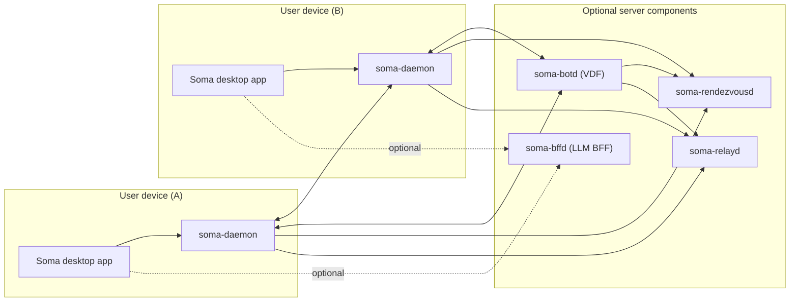

# 3. Context and Scope

Soma is a desktop-first system where each device runs a local daemon that participates in a libp2p network. Optional infrastructure improves discovery/connectivity, but user content stays on peers.

## Business context

- A “class” (also called “space” in parts of the codebase) is the unit of sharing and permissions.
- Users join a class by obtaining a signed membership capability.
- Content is primarily local; peers synchronize and fetch what they need.

## System context (high level)

## External interfaces

- **Desktop IPC**: `soma-daemon` gRPC API over UDS (`proto/daemon/v1/daemon.proto`).
- **P2P protocols**: libp2p request/response and pubsub protocols implemented in `backend/crates/peer`.
- **Infra HTTP**: health/metrics endpoints for server daemons (Axum).
- **LLM backends**: optional HTTP APIs consumed by `soma-bffd` (configurable endpoint/model).
