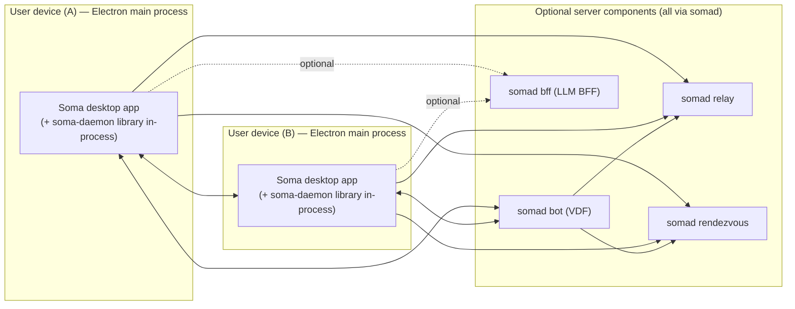

# 3. Context and Scope

Soma is a desktop-first system. Each device runs the Soma Electron app, which embeds a Rust libp2p peer (`soma-daemon` library) in-process via the `@soma/node` napi addon; the device participates in a libp2p network through that embedded peer. Optional server infrastructure improves discovery/connectivity, but user content stays on peers.

## Business context

- A “class” (also called “space” in parts of the codebase) is the unit of sharing and permissions.
- Users join a class by obtaining a signed membership capability.
- Content is primarily local; peers synchronize and fetch what they need.

## System context (high level)

## External interfaces

- **Renderer ↔ Main**: Electron IPC (the only inter-process surface on the desktop side; the daemon runs inside main).
- **P2P protocols**: libp2p request/response and pubsub protocols implemented in `backend/crates/peer`.
- **Infra HTTP**: health/metrics endpoints for the `somad` subcommands (Axum).
- **LLM backends**: optional HTTP APIs consumed by `somad bff` (configurable endpoint/model).
