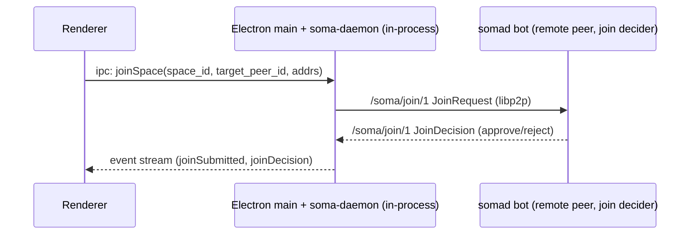
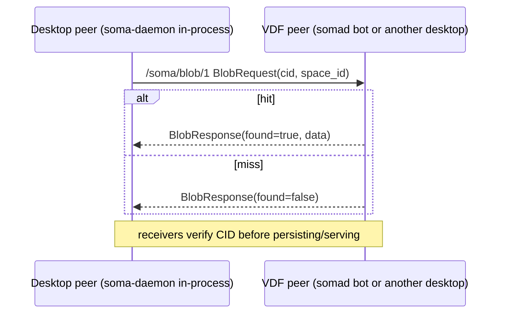
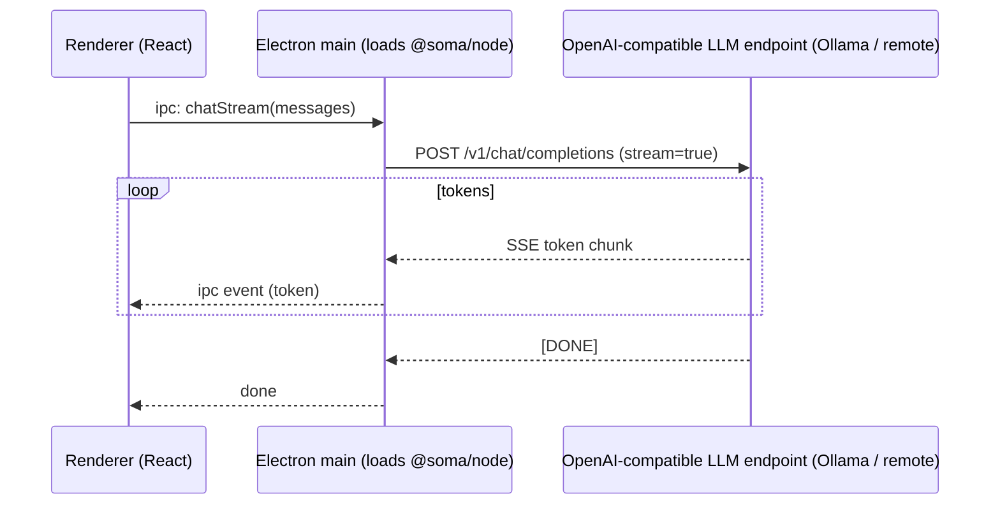

# 6. Runtime View

This section highlights a few “important at runtime” scenarios that are useful when debugging end-to-end.

## 6.1 Desktop app startup

```mermaid
sequenceDiagram
  participant UI as Renderer (React)
  participant Main as Electron main (loads @soma/node addon)
  participant Daemon as soma-daemon library (in-process)

  Main->>Daemon: start(config) — loads libp2p, opens DB, builds DaemonHandle
  Daemon-->>Main: SomaHandle (peer_id, listen addrs)
  UI->>Main: ipc: status()
  Main-->>UI: peer_id, listen addrs
  Note over Main,Daemon: daemon runs as part of the Electron main process;\nshut down when the app quits
```

## 6.2 Join flow (request → decision)



## 6.3 Blob fetch by CID (with VDF caching)



## 6.4 Local AI (streaming tokens)



Note: drift resolution uses the in-process `soma-agentd` library (via the
`@soma/node` addon); chat / list-models / rerank still go out over HTTP to the
configured OpenAI-compatible endpoint.

For a more detailed narrative, see `docs/src/architecture/e2e-flows.md`.
