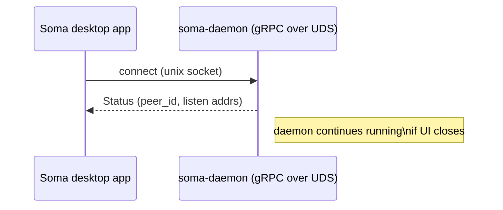
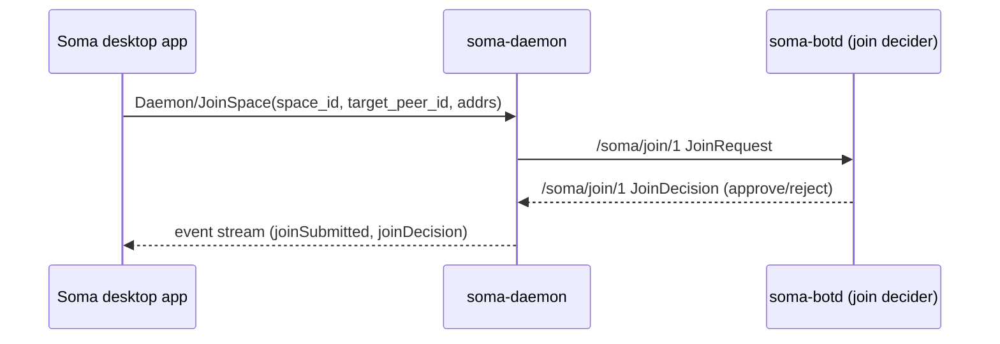
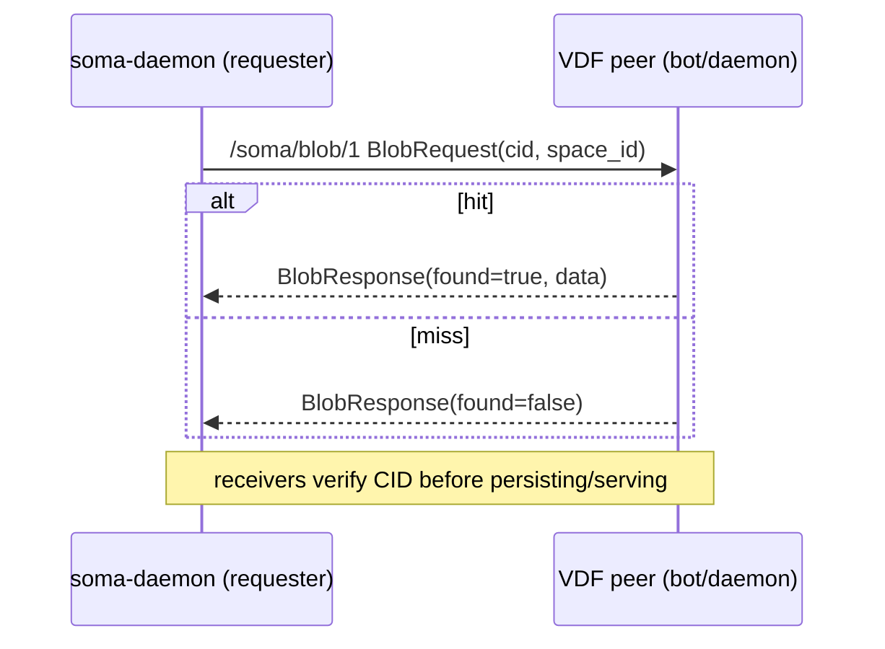
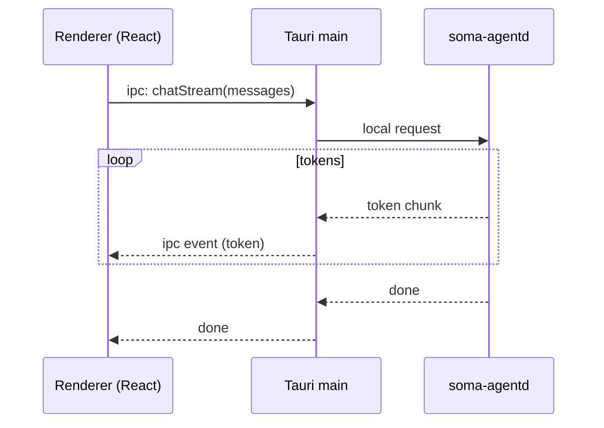

# 6. Runtime View

This section highlights a few “important at runtime” scenarios that are useful when debugging end-to-end.

## 6.1 Desktop app startup

## 6.2 Join flow (request → decision)

## 6.3 Blob fetch by CID (with VDF caching)

## 6.4 Local AI (streaming tokens)

For a more detailed narrative, see `docs/src/architecture/e2e-flows.md`.
