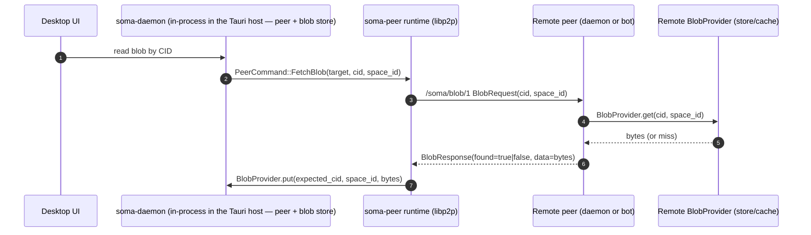

# Blobs and Cache-Serving Bots: Content-Addressed Storage + Fetch-by-CID

This doc describes Soma's blob layer: **content-addressed storage (CAS)** plus a **pull-based fetch-by-CID** protocol over libp2p.

Human model:

- attachments already stored on a device stay available there locally
- if another device opens an attachment for the first time, Soma may need a reachable authorized member device or cache-serving bot that already has a copy
- cache-serving bots improve availability, but they do not become the source of truth for uploads

It intentionally does **not** cover any virtual filesystem mapping (paths, directories, versioned mounts, etc.).

Terminology note:

- In repo discussions, a **VDF** is the **cache-only peer role** (most commonly `somad bot`).
- In code, the crate is currently named `soma-vdfs` for historical reasons.
- In user-facing docs, prefer **cache-serving bot** or **cache peer** over `VDF`.

## Goals

- Store binary assets (“blobs”: images, videos, files, editor attachments) **out of band** from collaborative document state.
- Address blobs by a stable **CID computed from bytes** (content address).
- Allow peers to **fetch a blob by CID** from any reachable authorized peer that has it (daemon store or bot cache).
- Keep the networking surface **pull‑based** (no “push bytes to bot” protocol).

## Non‑goals

- Virtual filesystem mapping / path semantics.
- HTTP upload endpoints for bots (`somad bot` stays cache‑only).
- Large file support beyond the current size-bounded request/response path.

## Concepts

- **Blob**: raw bytes + lightweight metadata (mime, name, size).
- **CID**: identity of a blob, computed from the blob’s bytes (today: SHA‑256 hex string).
- **Space scope**: blobs are stored under a `space_id` directory for layout and operational scoping.
- **Daemon store vs bot cache**:
  - The desktop daemon library (`soma-daemon`, embedded in-process in the Tauri host via `desktop-daemon`) is the source of truth for user‑created blobs (uploaded through the upload command surfaced by `@soma/sdk`).
  - `somad bot` is cache‑only for blobs (writes only as a side‑effect of fetching by CID).

## CID format (today)

- Algorithm: **SHA‑256**
- Encoding: **lowercase hex**
- Size: 64 chars (32 bytes)

Implementations:

- Shared filesystem store: `soma_vdfs::fs::FsBlobStore` (`backend/crates/vdfs/src/fs.rs`)
  - Used by both the in-process desktop daemon (authoritative store) and `somad bot` (cache-only by policy, populated via fetch).

Note: this is “CID” in the generic sense; it is not currently a multihash/CIDv1 string.

## Storage layout (filesystem)

Both daemon and bot use the same layout:

`<blob_root>/<space_id>/<cid>`

Examples:

- Desktop daemon blob root: configured by the Tauri host's `desktop-daemon` runtime config; the desktop app places it under the app data dir (`~/Library/Application Support/Soma/` on macOS, `~/.local/share/soma/` on Linux).
- `somad bot` blob root: configured by `--blob-dir` / `SOMA_BLOB_DIR` (see `backend/bins/somad/src/commands/bot/`).

## Local ingestion (desktop)

Desktop UX stages blobs locally and then uploads them to the in-process
daemon library:

- Renderer stages blobs locally and invokes an upload command via `@soma/sdk`.
- The Tauri host (`desktop-commands` → `desktop-api`) receives the bytes.
- Daemon persistence happens through the embedded daemon handle's
  `upload_blob`, after which the desktop renders daemon-owned blob references
  through `soma-blob://daemon/{space_id}/{cid}` (served by the host's
  `desktop-services::blob_protocol` handler).

Daemon ingestion path:

- In-process method on the embedded daemon handle (`upload_blob`) — see [DaemonHandle::upload_blob](../../../backend/crates/daemon/src/handle/blobs.rs).
- Size limit: `MAX_UPLOAD_BYTES = 8 MiB` (enforced in the daemon handle).

## Network fetch protocol (libp2p)

### Protocol id

- `/soma/blob/1` (see `BLOB_PROTOCOL` in `backend/crates/peer/src/lib.rs`)

### Transport

- libp2p request/response behaviour (`libp2p::request_response`)
- Request timeout: 30s (`backend/crates/peer/src/lib.rs`)

### Messages

Defined as `prost` messages in `backend/crates/peer/src/lib.rs`:

- `BlobRequest { cid: string, space_id: string }`
- `BlobResponse { cid, mime, size, data, found, space_id }`

Framing and limits:

- Messages are encoded with `prost` and framed with a 4‑byte big‑endian length prefix.
- `MAX_BLOB_MESSAGE_BYTES = 8 MiB` bounds any single blob request/response message.

This means blobs are currently limited to “small attachment” sizes.

## Provider boundary (`BlobProvider`)

`soma-peer` treats “blob storage” as a dependency injected into the peer runtime:

- Trait: `soma_vdfs::BlobProvider` (`backend/crates/vdfs/src/lib.rs`)
  - `get(cid, space_id) -> Option<BlobResponse>`
  - `put(expected_cid, space_id, bytes, mime) -> SomaResult<bool>` (implementations verify CID before writing)

Implementations:

- Desktop daemon library and `somad bot`: `soma_vdfs::fs::FsBlobStore` (`backend/crates/vdfs/src/fs.rs`)

Operational note: current filesystem implementations require a non‑empty `space_id` and will refuse to read/write if it is missing.

## Fetch flow (conceptual)

Today, the peer runtime already supports `/soma/blob/1` and `PeerCommand::FetchBlob`, while desktop rendering reads daemon-owned blobs through the Tauri host's `soma-blob://daemon/...` protocol handler.

## Security and limits

- Always enforce a maximum blob size at ingress (the upload command) and egress (network transfer). Current limit is 8 MiB on both paths.
- Always verify bytes match the CID before persisting or serving (both current FS implementations do this on `put`).
- Treat remote blobs as untrusted: do not automatically execute or render without appropriate UI sandboxing.
- Blob serving is membership-gated at the peer layer. Additional permission granularity may still evolve, but the fetch path is no longer intended to be open to non-members.

## Implementation note: shared FS backend

The desktop daemon library and `somad bot` share a single filesystem backend in `soma-vdfs`:

- `soma_vdfs::fs::FsBlobStore` (`backend/crates/vdfs/src/fs.rs`)

Policy-level differences ("authoritative store" vs "cache-only") are enforced by which code paths are exposed to users (the desktop upload command vs network pull-by-CID) rather than by separate storage implementations today.
