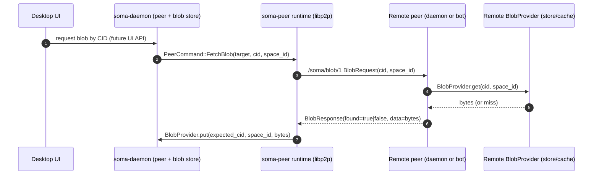

# Blobs (VDFS): Content‑Addressed Storage + Fetch‑by‑CID

This doc describes Soma’s minimal “VDFS” layer: **blob content‑addressed storage (CAS)** plus a **pull‑based fetch‑by‑CID** protocol over libp2p.

It intentionally does **not** cover any virtual filesystem mapping (paths, directories, versioned mounts, etc.).

## Goals

- Store binary assets (“blobs”: images, videos, files, editor attachments) **out of band** from collaborative document state.
- Address blobs by a stable **CID computed from bytes** (content address).
- Allow peers to **fetch a blob by CID** from any reachable peer that has it (daemon store or bot cache).
- Keep the networking surface **pull‑based** (no “push bytes to bot” protocol).

## Non‑goals

- Virtual filesystem mapping / path semantics.
- HTTP upload endpoints for bots (`soma-botd` stays cache‑only).
- Large file streaming/chunking (today: single request/response message, size‑bounded).

## Concepts

- **Blob**: raw bytes + lightweight metadata (mime, name, size).
- **CID**: identity of a blob, computed from the blob’s bytes (today: SHA‑256 hex string).
- **Space scope**: blobs are stored under a `space_id` directory for layout and operational scoping.
- **Daemon store vs bot cache**:
  - `soma-daemon` is the source of truth for user‑created blobs (local IPC upload).
  - `soma-botd` is cache‑only for blobs (writes only as a side‑effect of fetching by CID).

## CID format (today)

- Algorithm: **SHA‑256**
- Encoding: **lowercase hex**
- Size: 64 chars (32 bytes)

Implementations:

- Daemon store: `backend/bins/daemon/src/blob_store.rs`
- Bot cache: `backend/bins/botd/src/blob_cache.rs`

Note: this is “CID” in the generic sense; it is not currently a multihash/CIDv1 string.

## Storage layout (filesystem)

Both daemon and bot use the same layout:

`<blob_root>/<space_id>/<cid>`

Examples:

- Daemon blob root: configured by `--blob-dir` / `SOMA_BLOB_DIR` (see `backend/bins/daemon/src/config.rs`)
- Bot blob root: configured by `--blob-dir` / `SOMA_BLOB_DIR` (see `backend/bins/botd/src/config.rs`)

## Local ingestion (desktop)

Desktop UX stages blobs locally and only uploads them to the daemon when the document is synced/published:

- Renderer stages blobs via `window.api.blobs.stage(...)` (`desktop/soma/src/renderer/src/lib/blob.ts`)
- Main process persists staged bytes under `soma-blob://local/<blobId>` (`desktop/soma/src/main/services/documents-service.ts`)
- On publish/sync, staged blobs are migrated to daemon CAS via `Daemon/UploadBlob` and a local “blob id → cid” mapping is recorded (`desktop/soma/src/main/services/main-ipc-controller.ts`)

Daemon API:

- gRPC: `Daemon/UploadBlob` (`proto/daemon/v1/daemon.proto`, implemented in `backend/bins/daemon/src/grpc.rs`)
- Size limit: `MAX_UPLOAD_BYTES = 8 MiB` (`backend/bins/daemon/src/grpc.rs`)

## Network fetch protocol (libp2p)

### Protocol id

- `/soma/blob/1` (see `BLOB_PROTOCOL` in `backend/crates/peer/src/lib.rs`)

### Transport

- libp2p request/response behaviour (`libp2p::request_response`)
- Request timeout: 30s (`backend/crates/peer/src/lib.rs`)

### Messages

Defined as `prost` messages in `backend/crates/peer/src/lib.rs`:

- `BlobRequest { cid: string, space_id: string }`
- `BlobResponse { cid, mime, size, data, found, space_id }`

Framing and limits:

- Messages are encoded with `prost` and framed with a 4‑byte big‑endian length prefix.
- `MAX_BLOB_MESSAGE_BYTES = 8 MiB` bounds any single blob request/response message.

This means blobs are currently limited to “small attachment” sizes; large file support will require chunking/streaming.

## Provider boundary (`BlobProvider`)

`soma-peer` treats “blob storage” as a dependency injected into the peer runtime:

- Trait: `soma_peer::BlobProvider` (`backend/crates/peer/src/lib.rs`)
  - `get(cid, space_id) -> Option<BlobResponse>`
  - `put(expected_cid, space_id, bytes, mime) -> SomaResult<bool>` (implementations verify CID before writing)

Implementations:

- `soma-daemon`: `BlobStore` (`backend/bins/daemon/src/blob_store.rs`)
- `soma-botd`: `BlobCache` (`backend/bins/botd/src/blob_cache.rs`)

Operational note: current filesystem implementations require a non‑empty `space_id` and will refuse to read/write if it is missing.

## Fetch flow (conceptual)

Today, the peer runtime already supports `/soma/blob/1` and `PeerCommand::FetchBlob`; wiring a higher-level “request blob” API for the desktop/UI is a separate step.

## Security and limits

- Always enforce a maximum blob size at ingress (daemon IPC) and egress (network transfer). Current limit is 8 MiB on both paths.
- Always verify bytes match the CID before persisting or serving (both current FS implementations do this on `put`).
- Treat remote blobs as untrusted: do not automatically execute or render without appropriate UI sandboxing.
- Authorization is currently minimal; future work should gate downloads using membership/permissions (see `SPACE_PERMISSION_DOWNLOAD_BLOBS` in `proto/spaceroom/v1/membership.proto`).

## Planned refactor: dedicated VDFS crate

The current CAS logic is duplicated in the daemon and bot binaries. The planned direction is to extract a reusable crate (for Soma and other projects) that owns:

- CID type + hashing utilities (SHA‑256 hex)
- filesystem layout helpers (`<root>/<space_id>/<cid>`)
- one or more filesystem-backed implementations (write-enabled vs cache-only policy)
- the storage trait boundary currently defined in `soma-peer` (`BlobProvider`)

The `soma-peer` crate should keep the libp2p wiring and depend on the extracted crate for “blob/VDFS” types and primitives.

