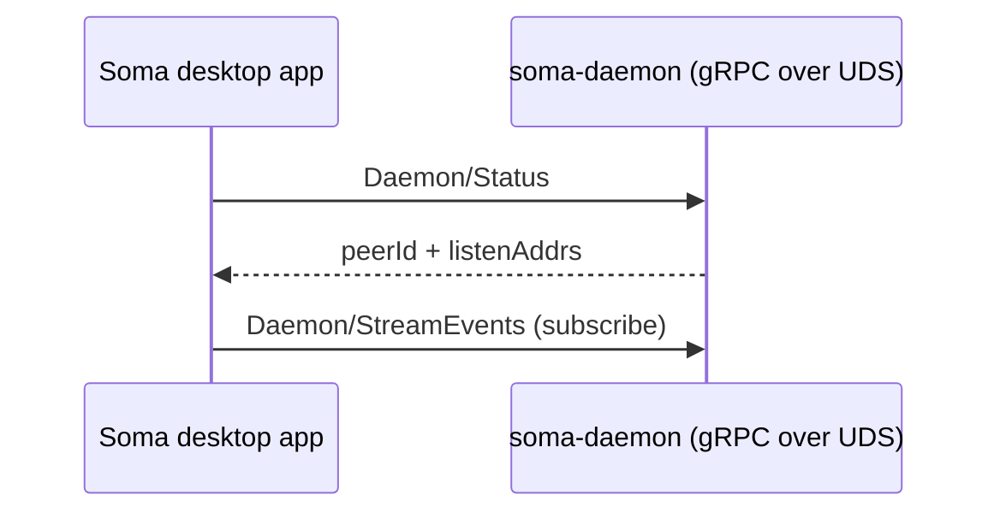
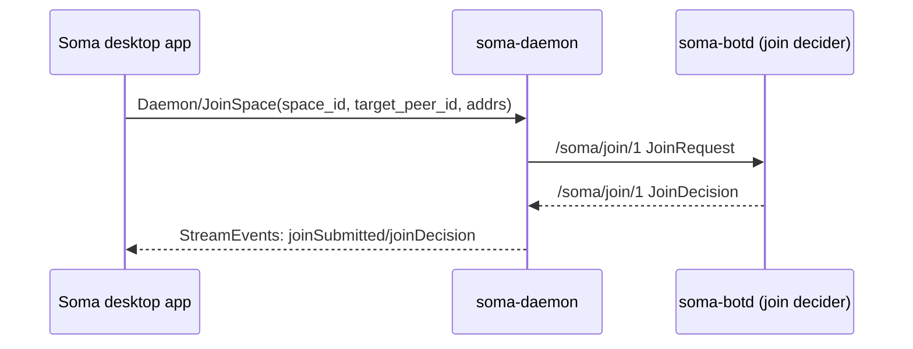
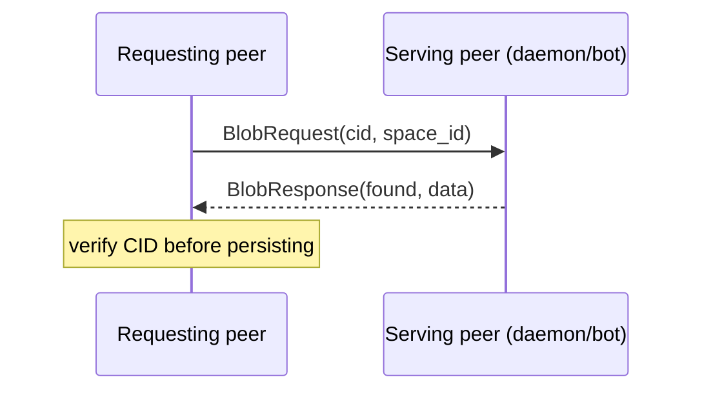
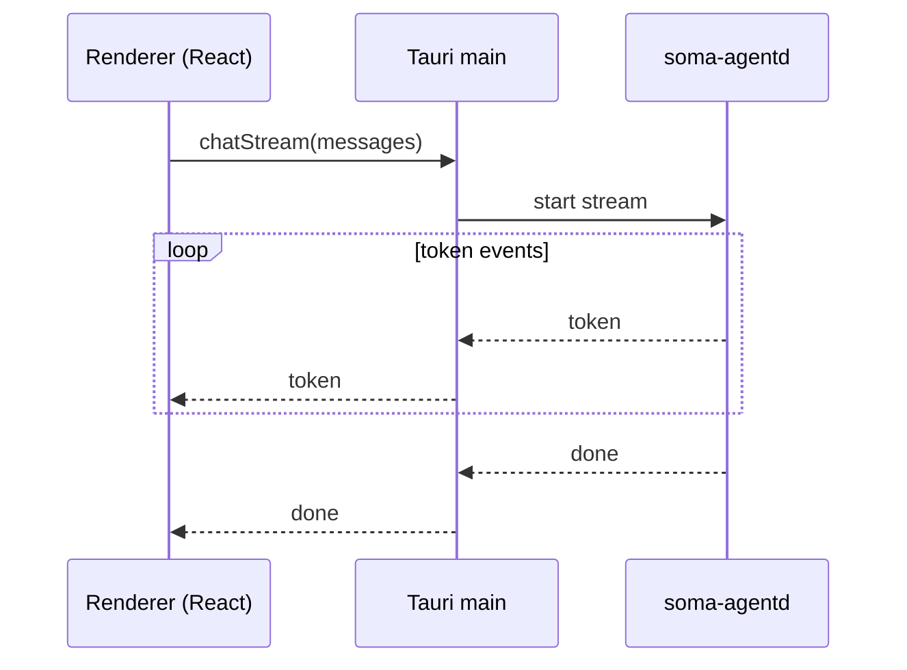

# End-to-End Flows (Soma)

This page documents a few “follow the bytes” flows across the repo so you can orient yourself when changing UI, daemon, or peer code.

## 1) Desktop app ↔ daemon (local IPC)

- Desktop apps live under `desktop/` (Soma: `desktop/soma`, Tapia: `desktop/tapia`).
- The local daemon is `soma-daemon` (`backend/bins/daemon`) and exposes gRPC over a Unix socket (`SOMA_DAEMON_SOCKET`).
- Protos: `proto/daemon/v1/daemon.proto` (compiled by `backend/crates/proto-build`).

High-level sequence:

## 2) Join a class/space (membership capabilities)

Flow summary:

1. UI asks the daemon to join a space/class.
2. The daemon sends a join request over libp2p.
3. A bot (or owner/issuer peer) decides and returns a join decision.
4. The daemon persists the outcome and notifies the UI via the event stream.

Relevant code:

- UI/API surface: `proto/daemon/v1/daemon.proto` (`Daemon/JoinSpace`, `Daemon/StreamEvents`)
- Peer protocol wiring: `backend/crates/peer/src/lib.rs` (protocol id `/soma/join/1`)
- Bot join decider wiring: `backend/bins/botd/src/runtime.rs`
- Daemon join wiring: `backend/bins/daemon/src/main.rs`, `backend/bins/daemon/src/handlers.rs`

See also: `docs/src/architecture/class-membership.md`.

## 3) Blob upload (desktop) and references

Design rule:

- Collaborative documents store **references** to blobs, not bytes.
- The daemon owns blob persistence; bots are cache-only.

On desktop, the UI typically stages a blob locally, then sends bytes to the daemon via IPC when the blob should become part of the content-addressed store.

See: `docs/src/architecture/blobs-vdfs.md`.

## 4) Fetch a blob by CID (with VDF caching)

Flow summary:

1. A peer requests bytes for `(space_id, cid)` over `/soma/blob/1`.
2. The remote peer reads from its blob provider (daemon store or bot cache).
3. The requester verifies the CID before persisting/serving.

Relevant code:

- Protocol id: `backend/crates/peer/src/lib.rs` (`/soma/blob/1`)
- Provider boundary: `backend/crates/vdfs/src/lib.rs` (`BlobProvider`)
- Filesystem implementation: `backend/crates/vdfs/src/fs.rs` (`soma_vdfs::fs::FsBlobStore`, used by both daemon and bot)

## 5) Local AI chat streaming (renderer → main → agent)

The desktop renderer initiates a streaming chat request via Tauri IPC. The Tauri main process coordinates the agent process (`soma-agentd`) and forwards token events back to the renderer.

Relevant code (desktop side):

- Renderer: `desktop/soma/src/renderer/src/services/chat-service.ts`
- Agent engine: `backend/bins/agentd/src/engine.rs`

## 6) Server LLM BFF (optional)

`soma-bffd` exposes an Axum HTTP API intended for deployments where LLM-backed features run on a server. It can be configured to call an external model HTTP endpoint.

See: `backend/bins/bffd/src/main.rs` and `backend/crates/bff/`.
