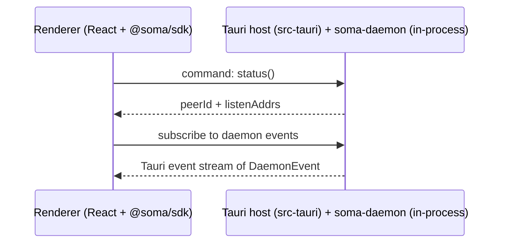
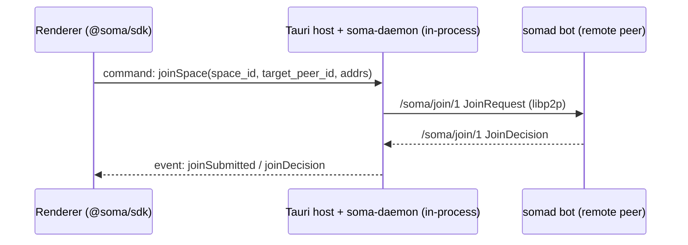
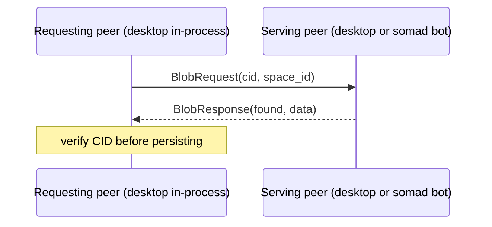
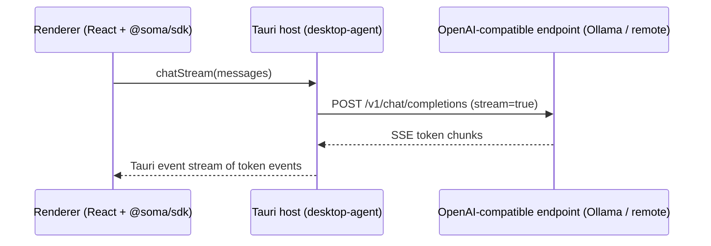

# End-to-End Flows (Soma)

This page documents a few "follow the bytes" flows across the repo so you can
orient yourself when changing UI, daemon, or peer code.

## 1) Desktop renderer ↔ Tauri host (with in-process daemon)

- The desktop app lives under `desktop/desktop-app` (a Tauri V2 shell). The
  React/Vite renderer is in `src/`; the Rust host is in `src-tauri/`. Tapia's
  `/practice` route is planned but not yet wired into the renderer router.
- The peer / daemon runtime is `soma-daemon` (`backend/crates/daemon`,
  library only), embedded by the host's `desktop-daemon` crate and run
  in-process. There is no separate daemon process and no IPC socket.
- The renderer reaches the host through `@soma/sdk` over Tauri commands
  (`createBackend(tauriTransport())`); wire types are generated from the Rust
  command graph via `tauri-specta`. The `proto/daemon/v1/daemon.proto` schema is
  Rust-only (libp2p wire formats), not a renderer transport.

High-level sequence:

## 2) Join a space (membership capabilities)

Flow summary:

1. The renderer asks the Tauri host (via `@soma/sdk`) to join a space.
2. The in-process daemon sends a join request over libp2p.
3. A bot (or owner/issuer peer) decides and returns a join decision.
4. The daemon persists the outcome and the renderer is notified through the
   event stream.

Relevant code:

- Command handler: `desktop/desktop-api` (transport-agnostic) surfaced as a `#[tauri::command]` in `desktop/desktop-commands`; the renderer calls it through `@soma/sdk`.
- Peer protocol wiring: `backend/crates/peer/src/lib.rs` (protocol id `/soma/join/1`).
- Bot join decider wiring: `backend/bins/somad/src/commands/bot/runtime.rs`.
- Daemon join handling: `backend/crates/daemon/src/handle/joins.rs`, `backend/crates/daemon/src/handlers/`.

See also: `docs/src/architecture/space-membership.md`.

## 3) Blob upload (desktop) and references

Design rule:

- Collaborative documents store **references** to blobs, not bytes.
- The daemon owns blob persistence; bots are cache-only.

On desktop, the renderer invokes an upload command through `@soma/sdk`
(`desktop-commands` → `desktop-api`), which hands the bytes to the in-process
daemon to publish into the content-addressed store.

See: `docs/src/architecture/blobs-vdfs.md`.

## 4) Fetch a blob by CID (with cache peer)

Flow summary:

1. A peer requests bytes for `(space_id, cid)` over `/soma/blob/1`.
2. The remote peer reads from its blob provider (daemon store or bot cache).
3. The requester verifies the CID before persisting/serving.

Current note:

- Blob serving is membership-gated at the peer layer; this is not an open
  fetch path for non-members.

Relevant code:

- Protocol id: `backend/crates/peer/src/lib.rs` (`/soma/blob/1`).
- Provider boundary: `backend/crates/vdfs/src/lib.rs` (`BlobProvider`).
- Filesystem implementation: `backend/crates/vdfs/src/fs.rs` (`soma_vdfs::fs::FsBlobStore`, used by both the in-process daemon and the server bot).

## 5) Model chat (renderer → main → provider)

The desktop renderer initiates a chat request through `@soma/sdk` over Tauri
commands. Chat / list-models / rerank go to an OpenAI-compatible HTTP endpoint
configured in the Tauri store (Ollama or a remote provider) and driven by the
`desktop-agent` client. The agent library (`soma-agentd`, embedded in-process)
is used only for in-process drift resolution and status; it does **not** proxy
model RPCs.

Relevant code (desktop side):

- Renderer chat surface: `desktop/desktop-app/src` (consumes `@soma/sdk`).
- Host agent client: `desktop/desktop-agent` (OpenAI-compatible chat/embed/rerank).

## 6) Server LLM BFF (optional)

`somad bff` exposes an Axum HTTP API intended for deployments where LLM-backed
features run on a server. It can be configured to call an external model HTTP
endpoint.

See: `backend/bins/somad/src/commands/bff/` and `backend/crates/bff/`.
