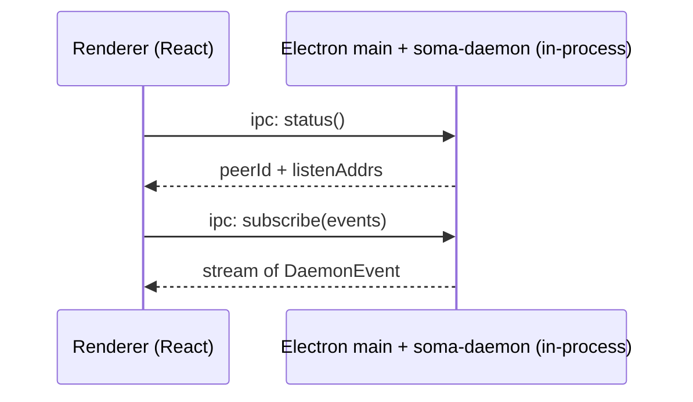
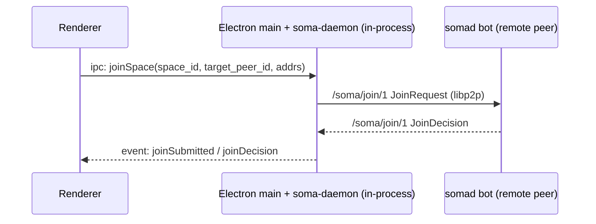
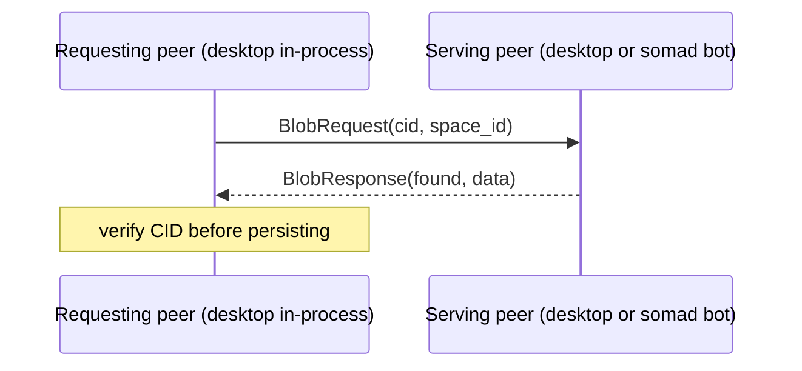
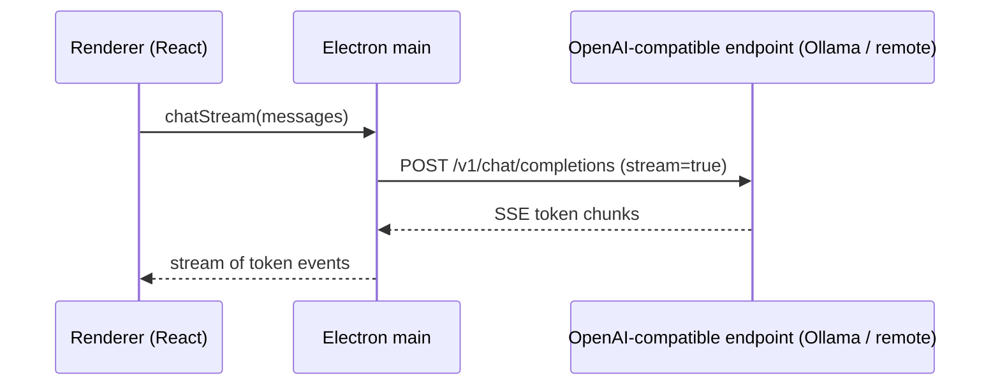

# End-to-End Flows (Soma)

This page documents a few "follow the bytes" flows across the repo so you can
orient yourself when changing UI, daemon, or peer code.

## 1) Desktop renderer ↔ Electron main (with in-process daemon)

- The desktop app lives under `desktop/soma`. Tapia is the `/practice` route
  inside it, not a separate Electron app.
- The peer / daemon runtime is `soma-daemon` (`backend/crates/daemon`,
  library only), linked into the `@soma/node` napi addon
  (`backend/crates/soma-node`) and loaded directly by the Electron main
  process. There is no separate daemon process and no IPC socket.
- Protos: `proto/daemon/v1/daemon.proto` (compiled by
  `backend/crates/proto-build`); used today only for record types like
  `DaemonEvent`, not as a transport.

High-level sequence:

## 2) Join a space (membership capabilities)

Flow summary:

1. The renderer asks Electron main to join a space.
2. The in-process daemon sends a join request over libp2p.
3. A bot (or owner/issuer peer) decides and returns a join decision.
4. The daemon persists the outcome and the renderer is notified through the
   event stream.

Relevant code:

- UI command surface: [DaemonClient.joinSpace](../../../desktop/soma/src/main/services/daemon-client.ts) → napi `joinSpace`.
- Peer protocol wiring: `backend/crates/peer/src/lib.rs` (protocol id `/soma/join/1`).
- Bot join decider wiring: `backend/bins/somad/src/commands/bot/runtime.rs`.
- Daemon join handling: `backend/crates/daemon/src/handle/joins.rs`, `backend/crates/daemon/src/handlers/`.

See also: `docs/src/architecture/space-membership.md`.

## 3) Blob upload (desktop) and references

Design rule:

- Collaborative documents store **references** to blobs, not bytes.
- The daemon owns blob persistence; bots are cache-only.

On desktop, the UI stages a blob locally, then hands the bytes to the
in-process daemon via the napi addon's `uploadBlob` to publish into the
content-addressed store.

See: `docs/src/architecture/blobs-vdfs.md`.

## 4) Fetch a blob by CID (with cache peer)

Flow summary:

1. A peer requests bytes for `(space_id, cid)` over `/soma/blob/1`.
2. The remote peer reads from its blob provider (daemon store or bot cache).
3. The requester verifies the CID before persisting/serving.

Current note:

- Blob serving is membership-gated at the peer layer; this is not an open
  fetch path for non-members.

Relevant code:

- Protocol id: `backend/crates/peer/src/lib.rs` (`/soma/blob/1`).
- Provider boundary: `backend/crates/vdfs/src/lib.rs` (`BlobProvider`).
- Filesystem implementation: `backend/crates/vdfs/src/fs.rs` (`soma_vdfs::fs::FsBlobStore`, used by both the in-process daemon and the server bot).

## 5) Model chat (renderer → main → provider)

The desktop renderer initiates a chat request via Electron IPC. Chat / list-models /
rerank go directly to an OpenAI-compatible HTTP endpoint configured in the
desktop runtime config (Ollama or a remote provider). The agent library
(`soma-agentd`, in-process via the napi addon) is used only for in-process
drift resolution and status; it does **not** proxy model RPCs.

Relevant code (desktop side):

- Renderer: `desktop/soma/src/renderer/src/services/chat-service.ts`
- Main: `desktop/soma/src/main/services/agent-client/openai.ts`

## 6) Server LLM BFF (optional)

`somad bff` exposes an Axum HTTP API intended for deployments where LLM-backed
features run on a server. It can be configured to call an external model HTTP
endpoint.

See: `backend/bins/somad/src/commands/bff/` and `backend/crates/bff/`.
