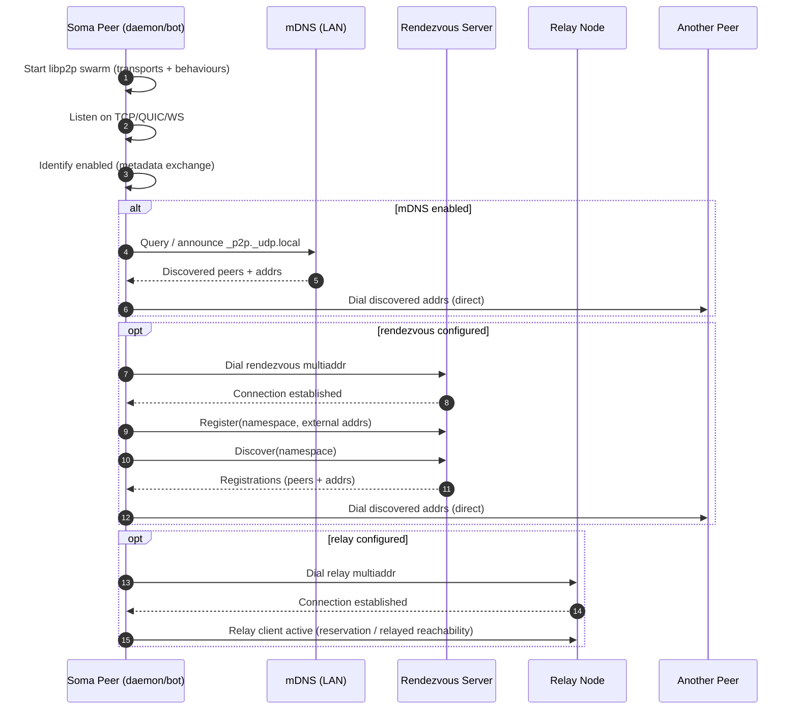
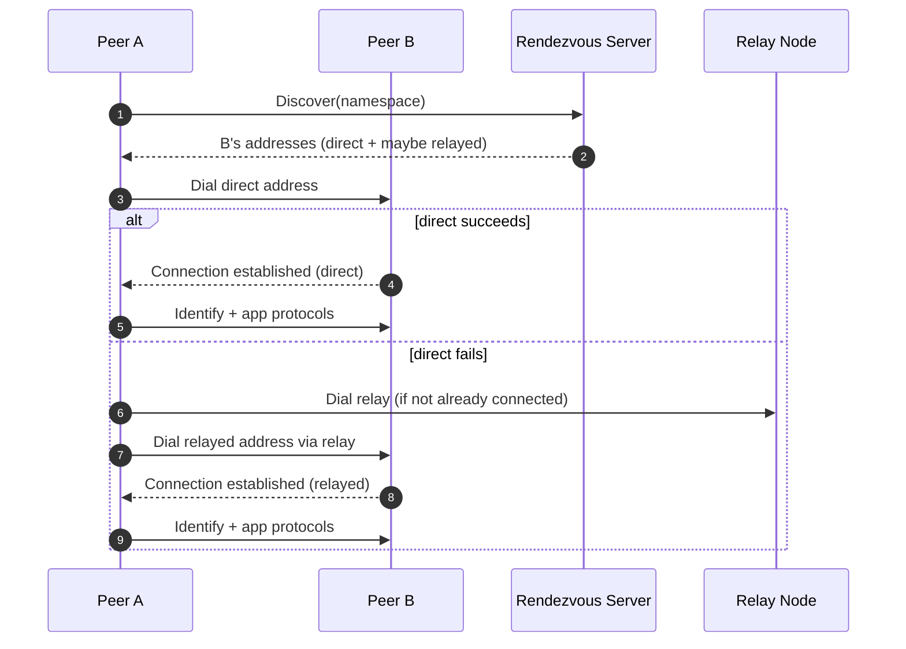

# Peer Connectivity (Daemon + Bot)

This doc describes how Soma peers (the desktop daemon runtime — `soma-daemon`, embedded in-process in the Tauri host via `desktop-daemon` — and `somad bot`) discover each other and establish connectivity using libp2p.

The implementation lives in the shared peer runtime: `backend/crates/peer` (`soma-peer`).

## Goals

- Work on LAN without any infrastructure (developer-friendly).
- Work across NAT / different networks with minimal configuration (production-friendly).
- Prefer direct connections, but fall back to relayed connections when necessary.

## User Expectations

- Content already stored on a device stays usable locally, even on weak networks.
- Peer-dependent actions such as new joins, first-time attachment fetches, and remote updates may wait until another peer is reachable.
- Relay, rendezvous, and cache peers improve reachability. They do not guarantee immediate delivery.
- Reachable is not the same as authorized. A peer may be online but still unable to serve a workspace if membership or cached content is missing.

## Mechanisms (in order of “what to try first”)

### 1) Direct dialing (preferred)

Peers always try to establish **direct connections** using the multiaddrs they learn from discovery (mDNS or rendezvous). Direct connections have the lowest latency and cost.

### 2) Identify (connection metadata)

Peers run the libp2p **Identify** protocol to exchange:

- supported protocol IDs,
- agent/version strings,
- observed addresses.

In Soma this is used primarily to improve debug visibility and to help other behaviours infer which addresses are usable.

### 3) mDNS (local network discovery)

When enabled, peers use libp2p mDNS to discover other peers on the same LAN and dial them automatically.

- Enabled by default in `soma-peer` and can be disabled via `--disable-mdns`.
- Useful for dev and for “same Wi‑Fi” connectivity.

### 4) Rendezvous (internet discovery)

Peers can dial one or more rendezvous servers and use the rendezvous **client** protocol to:

- register in a namespace,
- discover other registered peers,
- dial discovered peers.

Rendezvous is for discovery, not NAT traversal. It helps peers find each other when they are not on the same LAN.

### 5) Relay client (NAT traversal fallback)

Peers can dial one or more relay nodes and use the **relay client** behaviour.

Common pattern:

- peers proactively connect to configured relays,
- when needed, traffic can be routed through a relay (encrypted end-to-end by libp2p),
- direct connections are still preferred whenever available.

Note: dialing a relay node without running the relay client behaviour does not provide relayed reachability. Soma peers include the relay client behaviour as part of `soma-peer`.

## Sequence Diagrams

### Peer startup (mDNS + rendezvous + relay configured)

### Direct-first dialing with relay fallback (conceptual)

## Configuration

### Desktop daemon (embedded in the Tauri host)

The desktop daemon library reads its connectivity configuration from the
runtime config the Tauri host's `desktop-daemon` crate constructs at startup.
The relevant fields:

- `listenAddrs` (array of multiaddrs)
- `bootstrapAddrs`
- `rendezvousAddrs`
- `relayAddrs`
- `enableMdns`

There are no CLI flags or `SOMA_*` environment variables on the desktop side —
the host process constructs the config directly when it spins up the embedded
runtime.

### `somad bot` (server peer)

- `--listen-addrs` / `SOMA_LISTEN_ADDRS` (comma-delimited)
- `--bootstrap-addrs` / `SOMA_BOOTSTRAP_ADDRS` (comma-delimited)
- `--rendezvous-addrs` / `SOMA_RDV_ADDRS` (comma-delimited)
- `--relay-addrs` / `SOMA_RELAY_ADDRS` (comma-delimited)
- `--disable-mdns` / `SOMA_DISABLE_MDNS`

## Local Development Recipes

### Start infra

From the repo root:

- Relay: `just backend-run-relay`
- Rendezvous: `just backend-run-rendezvous`

Copy their logged listen multiaddrs (including `/p2p/<peerid>`).

### Run the desktop app and point it at infra

The Tauri app embeds the daemon runtime, so connectivity is configured by the
host's `desktop-daemon` crate when it constructs the runtime config at startup.
Adjust that config (or the desktop stage config it reads) to inject your local
`--rendezvous-addrs` / `--relay-addrs` equivalents.

### Observe behaviour

In logs you should see:

- connection establishment / errors,
- identify events,
- rendezvous discoveries,
- relay reservation acceptance / relayed circuits (when used).

## Troubleshooting

### A join request does not complete

- Confirm the requester has the correct approver peer ID and reachable connection addresses.
- Confirm the approver is actually authorized to approve for that space.
- Remember that a submitted request does not make the requester a member yet.
- If either peer is offline, approval delivery may be queued until connectivity returns.

### An attachment does not open on this device

- If the attachment was already fetched locally, it should still open without another peer.
- If this is the first fetch, the daemon may still need a reachable authorized peer or cache peer that already has the blob.
- Relay and rendezvous help peers find each other, but they do not store uncached attachment bytes.

### A peer looks reachable, but content still does not arrive

- Discovery is not the same as successful content delivery.
- Check whether the device is actually a member of the space before assuming blob or document access should work.
- Inspect daemon and bot logs for join failures, blob read failures, or missing membership state.
