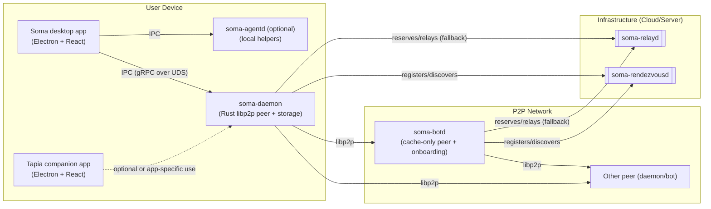
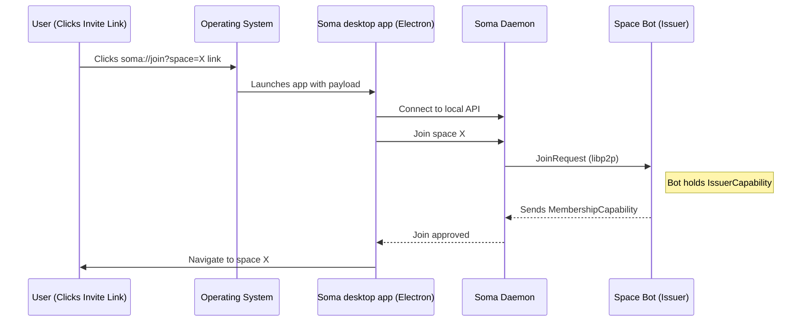

# Desktop Apps + Local Daemon (Soma platform)

Soma is a **desktop-first, local-first** platform with a small set of supporting server peers.

On a user device you typically run:

- **Soma desktop app** (`desktop/soma`, Electron + React) — the main UI for spaces, documents, and chat.
- **Tapia** (`desktop/tapia`, Electron + React) — a typing-practice companion app that shares stage/socket conventions, but currently has a lighter and less backend-integrated feature surface than Soma.
- **soma-daemon** (`backend/bins/daemon`) — the local Rust backend that owns the libp2p identity, storage, and networking.
- **soma-agentd** (`backend/bins/agentd`, optional) — a local helper process for desktop-only background helpers such as Yjs drift resolution.

This document explains how those pieces fit together and how optional infrastructure (relay/rendezvous/bots) improves connectivity and availability.

## Local daemon: `soma-daemon`

`soma-daemon` is a long-lived background process on every participating device. It:

- embeds a libp2p peer that holds the device’s private key and Peer ID (device identity).[^security]
- manages networking responsibilities: discovery, dialing, request/response protocols, pubsub topics, relay reservations, NAT traversal.
- persists identity material, memberships/capabilities, and other state needed across UI restarts.
- exposes a **local IPC API** (gRPC over Unix socket) so desktop apps can issue commands without re-implementing libp2p.

## Desktop apps: `desktop/soma` and `desktop/tapia`

The desktop apps focus on user experience and talk to the local daemon over IPC:

- **Soma desktop app (Electron)**: classes/spaces, documents, blobs, chat, onboarding flows.
- **Tapia (Electron)**: typing practice, short passages, and companion UX; it can read/write relevant data through the same daemon.

The key design rule is: **desktop apps do not implement libp2p**; they delegate network and security to `soma-daemon`.

## Optional local worker: `soma-agentd`

`soma-agentd` is a desktop-only helper process for local helper RPCs. It no longer proxies or serves model calls; model/provider access is handled by explicit provider paths outside agentd.

In the current desktop implementation, the Electron main process coordinates the agent process and forwards runtime updates back to the renderer.

See `docs/src/development/agentd-ipc.md` for the current topology and IPC notes.

## Architecture overview

## Deep linking (invite links)

The **Soma desktop app** registers the `soma://` URL scheme so invite links can open the app and hand the payload to the local daemon.

Because the daemon keeps running even if the UI exits, deep links can reattach quickly. Other daemon clients remain a possible future direction, but the current product path is the Electron desktop apps.

[^security]: https://docs.libp2p.io/concepts/security/security-considerations/
