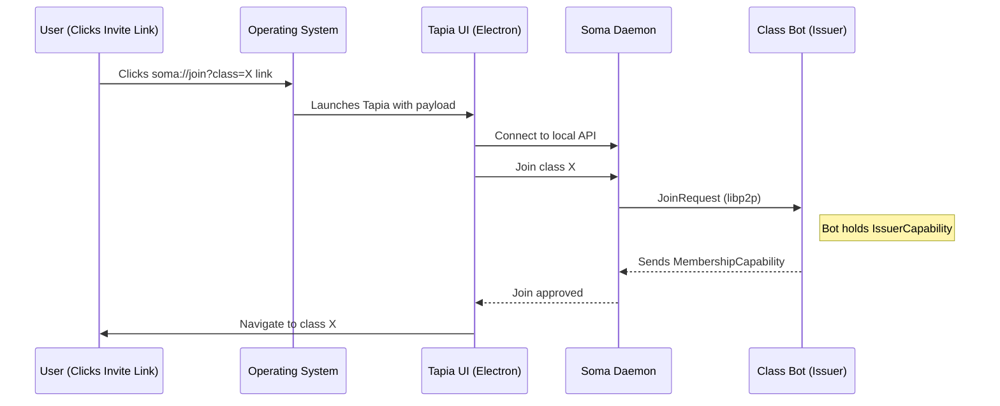

# Soma and Tapia Developer Introduction

The Soma platform is split into two cooperative parts:

- **Soma** — the Rust daemon that speaks libp2p, persists local data, and enforces capabilities.
- **Tapia** — the Electron/React UI and integration layer that humans interact with.

This document explains how those pieces fit together and what supporting infrastructure keeps the peer-to-peer (P2P) network healthy.

## Soma

Soma is a long-lived daemon that runs as a background service on every participating device. Each daemon instance:

- embeds a libp2p peer that holds the device’s private key and Peer ID, giving every user or bot a distinct cryptographic identity.[^security]
- manages networking responsibilities such as peer discovery, gossip topics, direct RPC protocols, relay reservations, and NAT traversal.
- persists identity material, cached class data, and any state Tapia or other clients might need between restarts.
- exposes a local IPC or HTTP/WebSocket API so UI processes can issue commands (“join this class”, “publish chat message”) without re-implementing networking.

The daemon keeps running even if Tapia is closed, which lets it monitor classes, receive background messages, and resume activity instantly when a UI reconnects.

## Tapia

Tapia is the user-facing desktop application (Electron + React/TypeScript). It focuses on:

- presenting class data, chat, membership status, and profile information in a friendly UI.
- orchestrating onboarding flows such as invite links and deep links.
- driving the local daemon via IPC to perform P2P actions, while remaining agnostic to libp2p specifics.

Because Tapia and the Soma daemon are decoupled, multiple front-ends—or even headless scripts—can talk to the same daemon. Tapia registers a custom URL scheme (`soma://`) so invite links from browsers or email launch the app and hand the payload to the daemon.

## Architecture Overview

```mermaid
flowchart LR
    subgraph "User Device"
        UI[Tapia UI<br/>(Electron + React)]
        Daemon[Soma Daemon<br/>(Rust libp2p Peer)]
        UI -- IPC/Local API --> Daemon
        UI <-- callbacks/updates -- Daemon
    end
    subgraph "P2P Network"
        Daemon -- libp2p (Gossip & RPC) --> Bot[Class Bot<br/>(Automated Agent)]
        Daemon -- libp2p --> PeerB[Other User's Daemon]
        Bot -- libp2p --> PeerB
    end
    subgraph "Infrastructure (Cloud/Server)"
        Rendezvous[[Rendezvous<br/>Server]]:::infra
        Relay[[Relay Node<br/>(libp2p Circuit Relay)]]:::infra
    end
    Daemon -- registers --> Rendezvous
    PeerB -- registers --> Rendezvous
    Daemon -- via relay if needed --> Relay
    PeerB -- via relay if needed --> Relay
    Bot -- via relay if needed --> Relay
    classDef infra fill:#EEE,stroke:#333,stroke-dasharray:5 5;
```

Each user device pairs Tapia with a local Soma daemon. The daemon communicates with other peers and bots over libp2p. Lightweight infrastructure nodes handle rendezvous-based discovery and relayed connectivity, but they never see decrypted user data.

## Local Soma Daemon (User Agent)

The local daemon is the authoritative “agent” for a user. It binds to local transports (QUIC/TCP, Unix sockets), registers with rendezvous, and implements the protocols that power chat, membership onboarding, publish/subscribe, and RPC flows. It stores the user’s capability tokens and cryptographic keys so that membership survives UI restarts. Incoming network events are pushed to Tapia via callbacks or subscriptions, and outgoing UI intent is translated into libp2p messages.

## Agents and Peers

In Soma, every agent is a libp2p peer with a unique Peer ID derived from its keypair.[^security] Human-operated daemons and autonomous bots all use the same primitives:

- authenticated, encrypted channels keyed by Peer IDs.
- multiplexed protocols so one connection can handle chat, membership, and file transfer simultaneously.
- capability-based permissions layered on top of libp2p’s identity to decide who may perform class actions.

A typical human controls one daemon/agent, while infrastructure might host many agents (bots, relays, rendezvous servers) for automation.

## Bots (Automated Agents)

Bots reuse the Soma daemon stack but replace the human UI with scripted logic. Common examples include auto-approving class bots that listen for `JoinRequest` messages, issue `MembershipCapability` tokens when eligible, welcome new members, or enforce moderation rules. Bots run either on developer machines for testing or in cloud environments for always-on availability. Network-wise, they look identical to any other peer—they have Peer IDs, connect via relay if required, and subscribe to the same topics.

## Relays and Rendezvous (Networking Infrastructure)

Even though Soma is decentralized, two infrastructure services keep connectivity reliable:

- **Rendezvous server** – This libp2p discovery service acts like a phonebook: peers register under a namespace (e.g., `soma-prod`) and query for other registered peers when they start.[^rendezvous] The address is configured in the daemon, and Helm charts are provided to deploy the service.
- **Circuit Relay nodes** – Public relay peers proxy encrypted traffic between endpoints that cannot reach each other directly due to NAT or firewalls.[^relay] Peers first attempt direct connectivity and only fall back to relays when necessary. They also try hole punching (DCUtR) to upgrade relayed sessions into direct links.

These services are stateless compared to user data—they never store application content and only facilitate discovery and transport.

## Tapia Integration and Deep Linking

Tapia treats the Soma daemon as a shared background service. On startup it checks whether the daemon is running, starts it if necessary, and then invokes the daemon’s API for every operation. Desktop installers register a custom protocol handler so clicking a `soma://` invite launches Tapia, which parses the link and instructs the daemon to execute the join workflow.



Because the daemon keeps running even if Tapia exits, deep links can reattach instantly, and future clients (CLI tools, alternate UIs) can reuse the same daemon.

[^security]: https://docs.libp2p.io/concepts/security/security-considerations/
[^rendezvous]: https://docs.libp2p.io/concepts/discovery-routing/rendezvous/
[^relay]: https://docs.libp2p.io/concepts/nat/circuit-relay/
