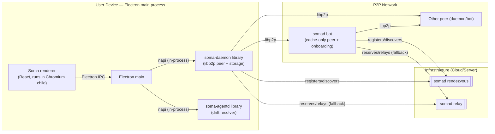
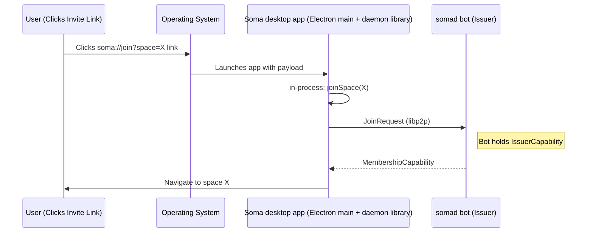

# Desktop Apps + Local Daemon (Soma platform)

Soma is a **desktop-first, local-first** platform with a small set of
supporting server peers.

On a user device you typically run:

- **Soma desktop app** (`desktop/soma`, Electron + React) — the main UI for
  spaces, documents, and chat. The Electron main process loads the
  `@soma/node` napi addon, which embeds the libp2p peer (`soma-daemon`
  library) and the agent runtime (`soma-agentd` library) in-process.
- **Tapia** (`desktop/tapia`, Electron + React) — a typing-practice companion
  app that shares stage conventions, but currently has a lighter and less
  backend-integrated feature surface than Soma.

There is no separate daemon process and no IPC socket; "the daemon" is a
library running inside the Electron main process.

## Local daemon (in-process via `@soma/node`)

The daemon runtime owns the device's libp2p identity, storage, and networking,
even though it is no longer a separate process. It:

- embeds a libp2p peer that holds the device's private key and Peer ID
  (device identity).[^security]
- manages networking responsibilities: discovery, dialing, request/response
  protocols, pubsub topics, relay reservations, NAT traversal.
- persists identity material, memberships/capabilities, and other state
  needed across UI restarts (SQLite + on-disk blob pool under Electron's
  `userData/daemon/`).
- exposes an **in-process API** (the `DaemonHandle` Rust facade, surfaced to
  JS as the `SomaHandle` napi class) so the Electron main process can issue
  commands without re-implementing libp2p.

## Desktop apps: `desktop/soma` and `desktop/tapia`

The desktop apps focus on user experience. The renderer talks to Electron
main over Electron IPC; main calls the embedded daemon directly through napi:

- **Soma desktop app (Electron)**: classes/spaces, documents, blobs, chat,
  onboarding flows.
- **Tapia (Electron)**: typing practice, short passages, and companion UX.

The key design rule is unchanged: **the renderer does not implement libp2p**;
it delegates network and security to the daemon runtime running in main.

## Optional local worker: `soma-agentd`

`soma-agentd` is the desktop-only agent runtime, packaged as a library and
linked into the same `@soma/node` addon. It handles in-process Yjs drift
resolution and exposes a small status/list-models surface. It does **not**
proxy or serve chat / embed / rerank — those go directly from the Electron
main process to an OpenAI-compatible HTTP endpoint configured in the desktop
runtime config.

## Architecture overview

## Deep linking (invite links)

The **Soma desktop app** registers the `soma://` URL scheme so invite links
can open the app and hand the payload to the daemon runtime (in-process).

The daemon runtime lives for as long as the Electron main process. Quitting
the app stops everything; there is no separate daemon left behind.

[^security]: https://docs.libp2p.io/concepts/security/security-considerations/
